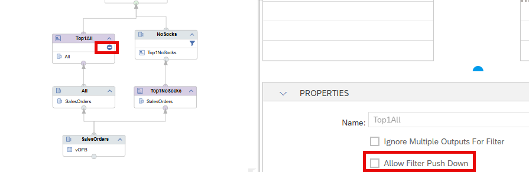
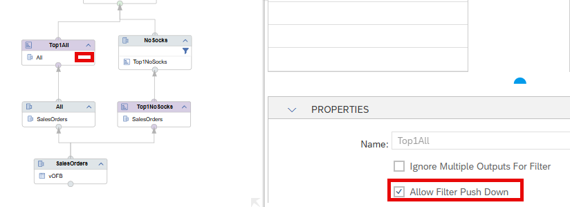
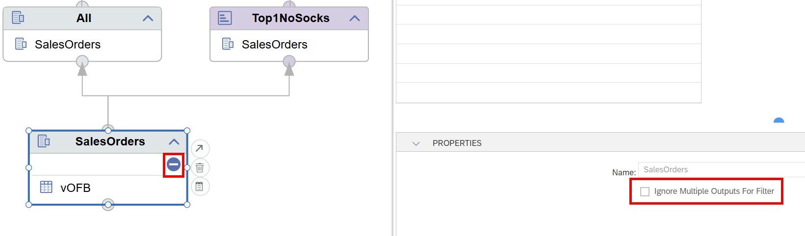
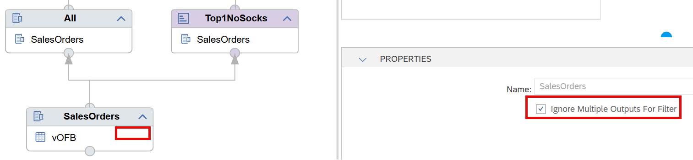
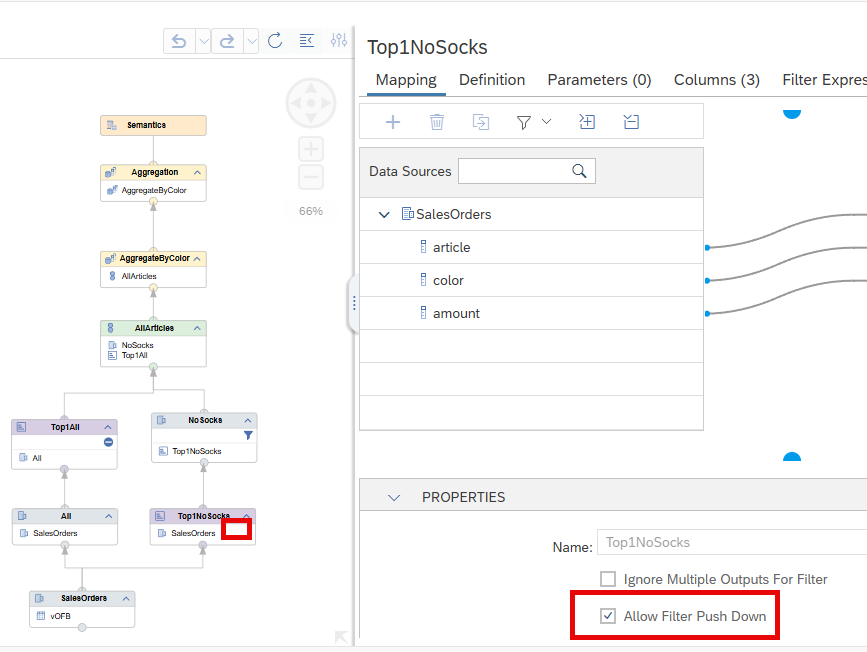

# [Visualize Blockers of Filter Push-Down](https://help.sap.com/docs/hana-cloud-database/sap-hana-cloud-sap-hana-database-modeling-guide-for-sap-business-application-studio/enforce-filter-pushdown)

Filters are applied as soon as possible during query processing to reduce the amount of records early. Some node types or modeling patterns however block the push-down of filters (filter expressions or query filters) per default due to the potential impact on the results. Often dedicate options exist to enforce the push-down of filters also in this case.

Nodes or modeling patterns that block the push-down of filters are now marked by an 

 icon so that it becomes easier to detect and deal with situations in which the filter push-down is blocked.

Below is an example where a Rank node blocks filter push-down:

If you enable the filter push-down the icon disappears:

Similarly, the below modeling pattern of two consuming nodes blocks the push-down per default:

Enforcing the filter push-down again unblocks the filter push-down and the icon disappears:

## Example
In example [vOFB_cv](./vOFB_cv.hdbcalculationview), the filter on node *NoSocks* is only pushed down if 

a) the push-down filter option is set in node *Top1NoSocks* which is otherwise blocking filter push-down as a Rank node per default 

b) additionally the multiple consumer pattern is not blocking filter push-down. This unblocking can be achieved by setting the Ignore Multiple Outputs for Filter option:

If the filter in *NoSocks* is successfully pushed down then the same results are returned for columns *NoSocks* and *All*.

> Quickly identify potential blockers for filter push down and decide based on your business needs whether to remove the blockers or not