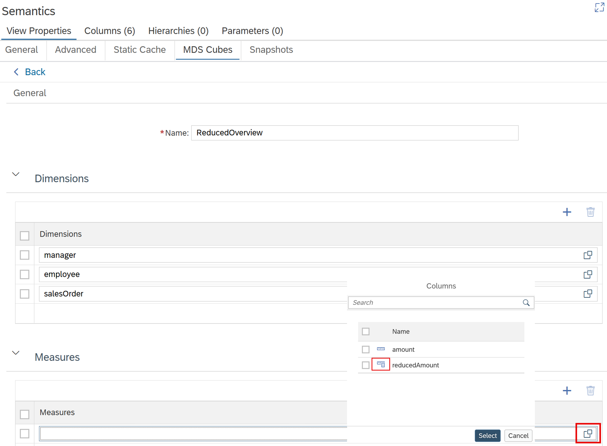

# [Calculated Measures in MDS Cubes](https://help.sap.com/docs/hana-cloud-database/sap-hana-cloud-sap-hana-database-modeling-guide-for-sap-business-application-studio/define-mds-cube-based-on-elements-in-calculation-view)

As of QRC2, calculated measures can be added to MDS Cubes and are evaluated at query runtime:

If a calculated measure cannot be translated into an MDS formula, deployment fails and reports the unsupported expression.

> Use calculated measures in MDS Cubes to execute calculations at query runtime.