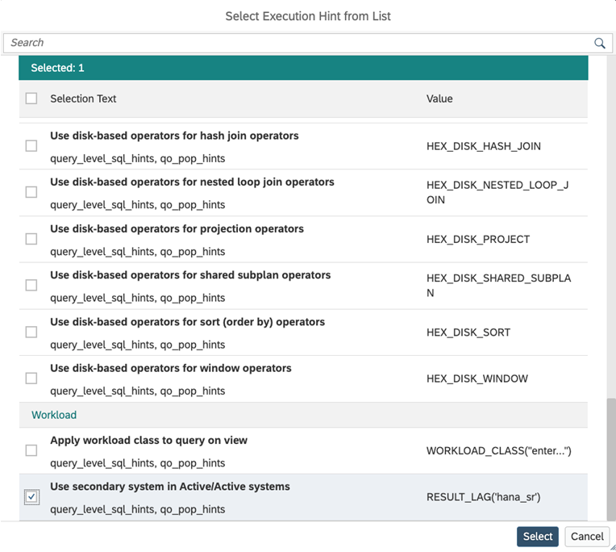

# [Active/Active Read-Enabled Hints](https://help.sap.com/docs/hana-cloud-database/sap-hana-cloud-sap-hana-database-modeling-guide-for-sap-business-application-studio/supported-execution-hints)

In an Active/Active (Read-Enabled) setup, hints can be used to direct queries to the read replica:

Hints are added at the individual calculation view level, giving fine-grained control over query routing. This allows workload to be distributed between the primary and replica systems, increasing overall throughput.

> **Note:** Only hints on calculation views directly referenced in the query are evaluated.