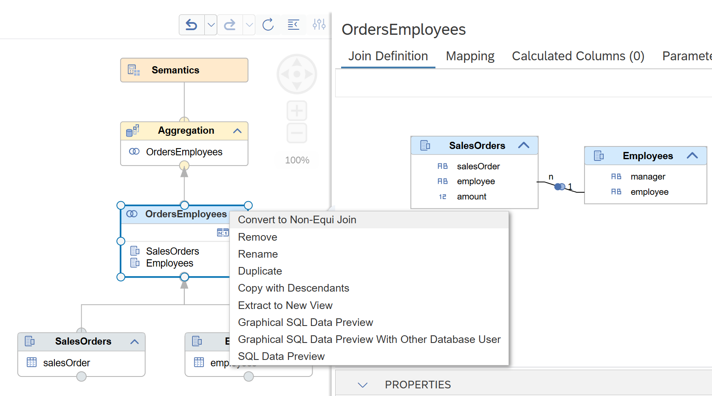
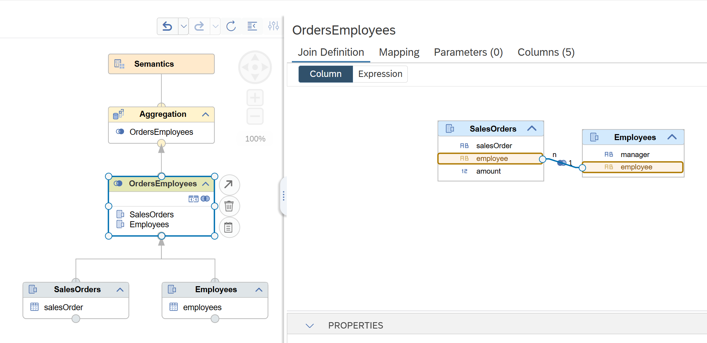
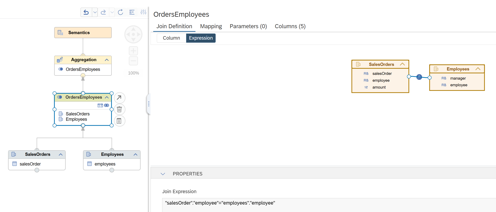

# [Switching from Join to Non-Equi Join Node](https://help.sap.com/docs/hana-cloud-database/sap-hana-cloud-sap-hana-database-modeling-guide-for-sap-business-application-studio/convert-join-nodes-to-non-equi-join-nodes)

A Join node can be converted to a Non-Equi Join node directly via the Join node's context menu:

You can choose during conversion whether the resulting join condition should be defined based on the graphical column display 

or the join expression

This offers greater flexibility and simplifies refactoring of join logic.

> **Note:** Features not supported by Non-Equi Join nodes, including dynamic, semi, text, and spatial joins and calculated columns and filter expressions, will be removed during the conversion.