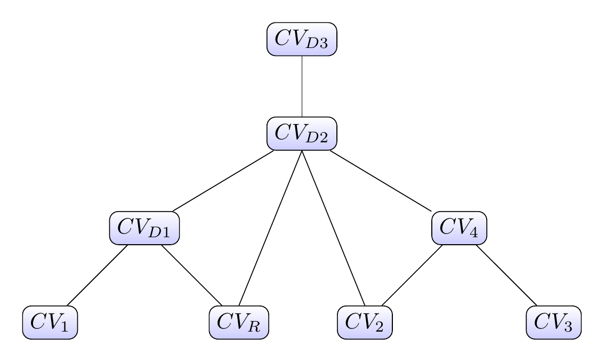
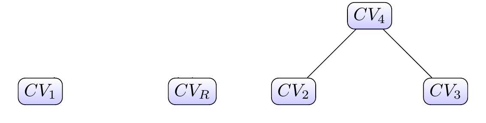
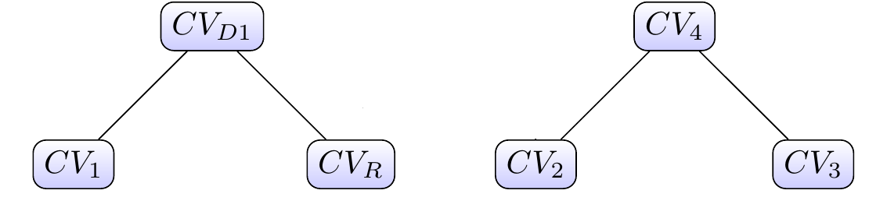
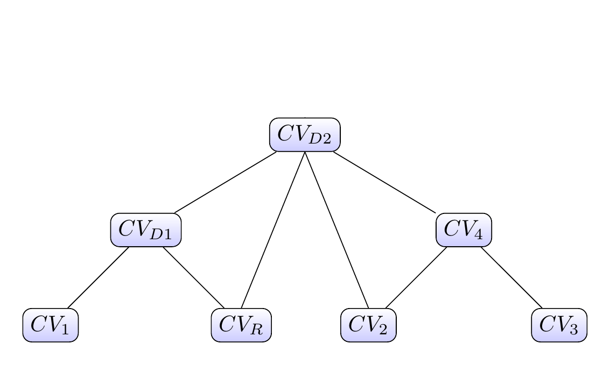

# [Optimized Redeployment](https://help.sap.com/docs/hana-cloud-database/sap-hana-cloud-sap-hana-database-performance-guide-for-developers/optimized-redeployment-of-calculation-views)

## Default Redeployment Mechanism

When a calculation view is redeployed in a stacked scenario, all dependent objects in the same HDI container that consume the redeployed calculation view are first dropped and then sequentially recreated after the calculation view has been redeployed.

For example, when deploying $CV_R$ in the following figure:



In a first step, the dependencies $CV_{D1}$, $CV_{D2}$, and $CV_{D3}$ are undeployed:



Next, $CV_R$ is redeployed and the dependencies are restored step by step:






Dropping the dependencies avoids recursive revalidations. For example, if redeploying $CV_R$ also requires redeployment of $CV_{D1}$, then $CV_{D2}$ and $CV_{D3}$ would need revalidation. Deploying $CV_{D2}$ afterwards would again trigger revalidation of $CV_{D3}$. Dropping all dependencies upfront eliminates these cascading revalidations.

However, dropping dependencies has a side effect: privileges on the underlying objects are revoked.

- **Privileges assigned within the same HDI container** (e.g., in a container role) are revoked during deployment and automatically regranted at the end. This only impacts deployment time.
- **Privileges assigned outside the current HDI container** (e.g., in an HDI role of another HDI container that directly reference the calculation view) are **permanently revoked** and will not be restored automatically.

Temporarily revoked privileges slow down deployments. Permanently revoked privileges can additionally cause runtime failures due to missing access rights.

## Optimized Redeployment

Optimized redeployment addresses the performance drawback described above. Instead of dropping all dependent objects upfront, a consistency check determines whether each dependent object is still valid with respect to the redeployed calculation view. If a dependent view is unaffected by the change, for example, if the change to $CV_R$ does not invalidate $CV_{D1}$, it is kept as-is and not redeployed.

This reduces:
- Time spent recreating unaffected dependent views
- Privilege reassignment overhead

The trade-off is a small upfront cost for the explicit consistency check. In most scenarios the net effect is a faster deployment.

To minimize impact on existing deployments, optimized redeployment is **not enabled by default**.

## Enabling Optimized Redeployment

### Per plug-in

To enable optimized redeployment specifically for calculation views, pass the following parameter to the `hdi-deploy` command in `package.json`:

```text
com.sap.hana.di.calculationview/optimized_redeploy=true
```

The resulting `start` script in `package.json`:

```json
"start": "node node_modules/@sap/hdi-deploy/deploy.js --parameter com.sap.hana.di.calculationview/optimized_redeploy=true"
```

### Globally

The global parameter

```text
optimized_redeploy=true
```

activates optimized redeployment for **all** HDI object types that support it. Use this option with care - it affects not only calculation views but all supporting object types in the container.

---

If you encounter a scenario where optimized redeployment is slower than the default behavior, open a low-priority incident on component `HAN-DB-CLS`.

> Use this option to speed up redeployment of calculation views

