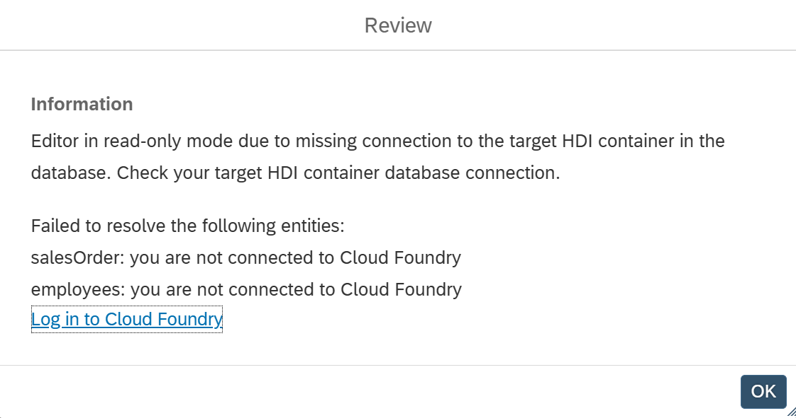

# Calculation View Status Dialog

When opening a calculation view with certain properties, a dialog displays details about the current view. Where applicable, the dialog also offers actions to resolve issues for example, prompting you to log in to Cloud Foundry if no database connection is available:

The dialog reports on the following:

- **Read-only mode** - reasons why the calculation view has been opened in read-only mode
- **Database connection** - current connection status to the database
- **Data classification inconsistencies** - detected mismatches in the [data classification](https://help.sap.com/docs/hana-cloud-database/sap-hana-cloud-sap-hana-database-modeling-guide-for-sap-business-application-studio/data-classification-for-calculation-views) setting
- **BDC integration** - whether the calculation view is used with [BDC integration mode](https://help.sap.com/docs/hana-cloud-database/sap-hana-cloud-sap-hana-database-modeling-guide-for-sap-business-application-studio/calculation-views-for-sap-business-data-cloud)