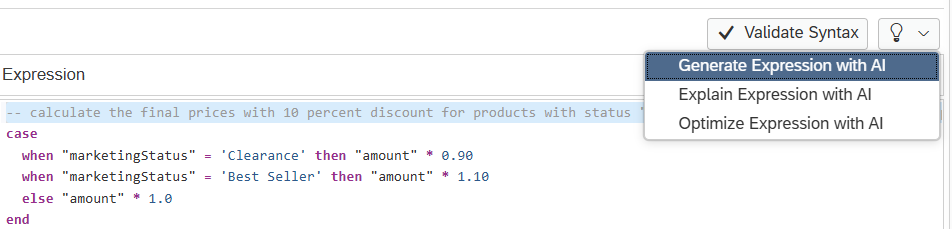
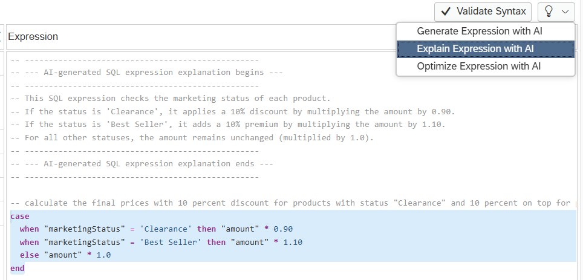
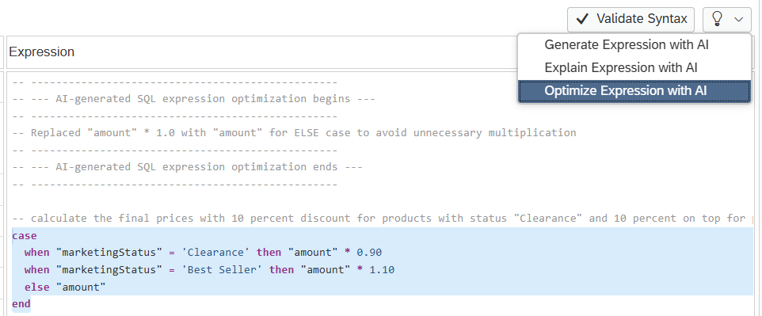

# [Generate Expressions Leveraging AI support](https://help.sap.com/docs/HANA_CLOUD_DATABASE/d625b46ef0b445abb2c2fd9ba008c265/19358c16f6004f9ea06eda13d428f671.html)

To generate expressions in calculated columns, restricted columns or filter expressions, describe your intend in natural language as a comment in the expression editor:

-- calculate the final prices with 10 percent discount for products with status "Clearance" and 10 percent on top for products with status is "Best Seller"

Use the AI option *Generate Expression with AI* to generate the corresponding statement. The AI decision will be based on the available column names in the current node and your comment.

Similarly you can mark your expression and choose *Explain Expression with AI* to better understand an existing expression, 

or you can choose AI support to *Optimize Expression with AI*, e.g. removing redundant checks or calculations

> Using AI support can lead to additional costs depending on your contract. Given that the result is AI generated, carefully check the correctness.

> Leverage AI to simplify creating expressions and to optimize expressions 