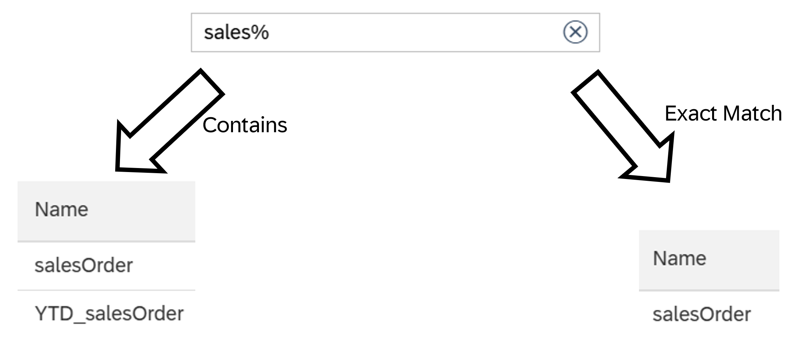

# Find Data Sources with Exact Matches

When searching for data sources in calculation views or analytic privileges, you can switch between two search modes: *Contains* and *Exact Match*.

- *Contains* returns any object whose name includes the search string, regardless of position which is the Default mode.
- *Exact Match* matches the full object name and supports SQL wildcards \_ (single character) and \% (any characters).

Example: Searching "sales\%" in Exact Match mode returns objects whose names start with "sales" - but excludes objects where "sales" appears mid-name, such as "YTD_salesOrder".

The last selection is remembered per workspace.

*Exact Match* is required for [Analytic Privilege Wildcard Patterns](https://help.sap.com/docs/hana-cloud-database/sap-hana-cloud-sap-hana-database-modeling-guide-for-sap-business-application-studio/create-analytic-privileges):

*Exact Match* is the only mode that supports wildcard patterns when adding Secured Models in the analytic privilege editor. You must be in *Exact Match* mode to enter a wildcard pattern - the option is unavailable in *Contains* mode.

> Switch to *Exact Match* when you need positional precision in search results, or when adding wildcard patterns to secured models in analytic privileges.
