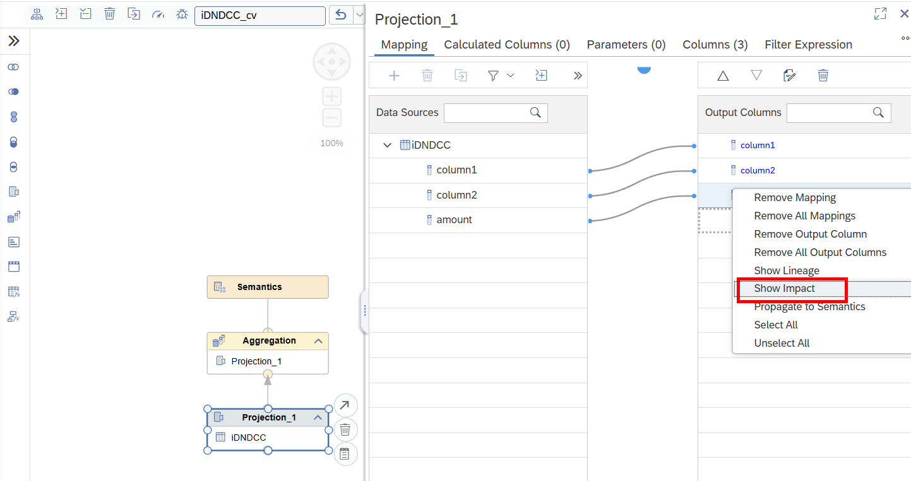
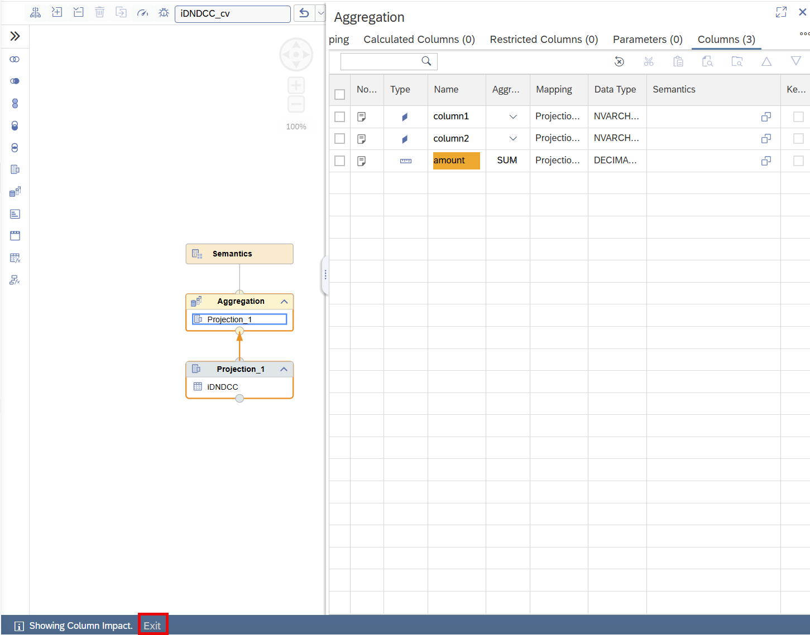

# [Column Impact Within Model](https://help.sap.com/docs/HANA_CLOUD_DATABASE/d625b46ef0b445abb2c2fd9ba008c265/da579d2b54e14f6592069d0c2c376042.html?locale=en-US)

[Column lineage](https://help.sap.com/docs/hana-cloud-database/sap-hana-cloud-sap-hana-database-modeling-guide-for-sap-business-application-studio/13538ddb57924150b3ca62a53749dc99.html) allows to trace the sources of a column. In contrast, to find out where a column is used in the current calculation view, use *Show Impact* in the Mapping pane:

This will display the impacted columns within the current calculation view.

To turn off the column impact mode, select *Exit* on the lower left side:

> Use column impact information to understand the impact a change of a column has before executing the change