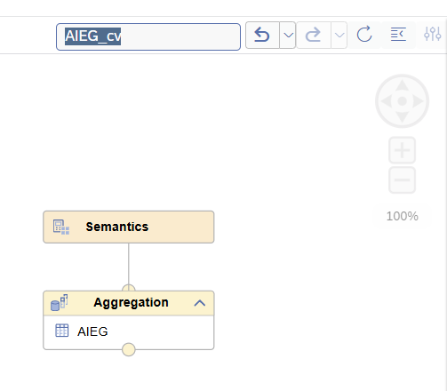
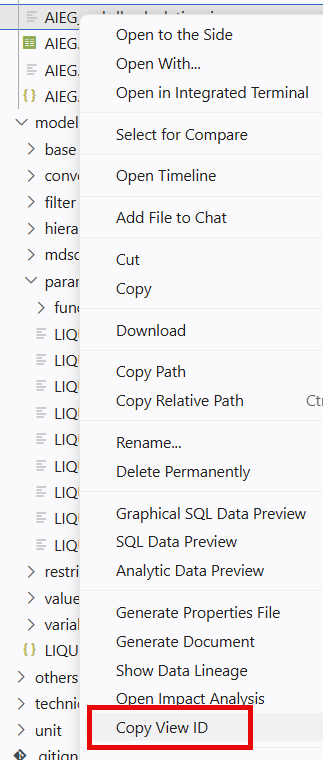

# [Simplified Copying of Calculation View ID](https://help.sap.com/docs/HANA_CLOUD_DATABASE/d625b46ef0b445abb2c2fd9ba008c265/f9dd3400d75741a7a1d845b869ed0ae6.html?locale=en-US)

The calculation view ID determines the name of the calculation view object that is created in the database. The ID is now displayed in several places and also at the top of the editor screen. 

Clicking into the box automatically copies the calculation view ID:

A dedicated option to copy the calculation view ID is also available in the modelling section of the context menu of a calculation view:

> Use the option to quickly copy the calculation view ID without the need to open the calculation view