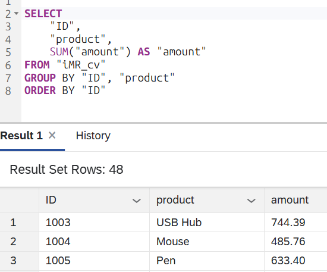
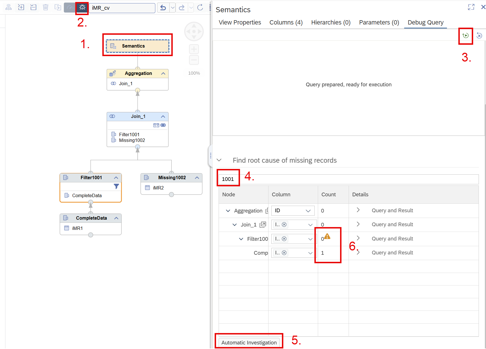
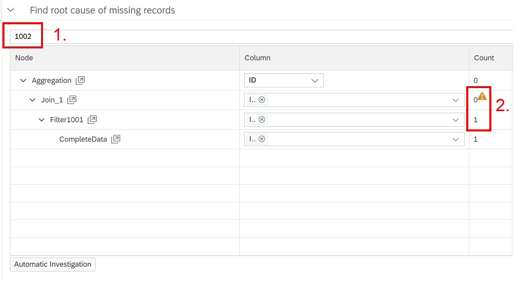
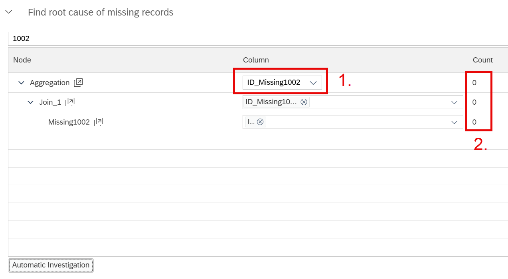

# Debug Mode: Tracing Missing Records

Use Debug Mode to pinpoint exactly where a specific record disappears within a calculation view. Before using this functionality ensure that the calculation view under investigation is successfully deployed to the database.

When you specify a column value to investigate, you can trigger in Debug Mode queries against each node in the model. The result shows how often that record is returned at each node, letting you quickly identify the node where it drops out - and focus your analysis there.

## Example

In the output of calculation view [iMR_cv](./iMR_cv.hdbcalculationview) records with ID 1001 and 1002 are missing:

```SQL
SELECT 
	"ID",
	"product",
	SUM("amount") AS "amount"
FROM "iMR_cv"
GROUP BY "ID", "product"
ORDER BY "ID"
```



In Debug Mode you can search for value *1001* and see where this record is lost:



In the example:
- Select the Semantics node (1.) and start the Debug Mode (2.)
- Execute the default query (3.)
- Enter the search value *1001* (4.) and start *Automatic Investigation* (5.)

This triggers queries against each node of the calculation view checking the presence of the specified value *1001*. From the results you can see that the value is present after node *CompleteData* but missing after node *Filter1001* (6.).

With this information you can start looking into node *Filter1001* and find out that there is an explicit filter defined which removes records with the *ID* value *1001*.


Next, search for value 1002 (1.):



From the result (2.) you can easily identify that the record is lost in node Join_1. You can now do a quick cross-check whether the value is coming from the other data source of node *Join_1* by selecting column *ID\_Missing1002* (1.) from the second source that is joined to *ID* from the first source:



This reveals (2.) that the value *1002* is completely missing in the stack that feeds into the join node as second source (2.).

Investigating the join node in more detail will reveal that due to the inner join setting the missing record *1002* from the second source removes the record also from the first source.


Note: Trace queries run against every node in the model. Execution time scales with model complexity and query scope. 

> Use Debug Mode to quickly identify where a record gets lost