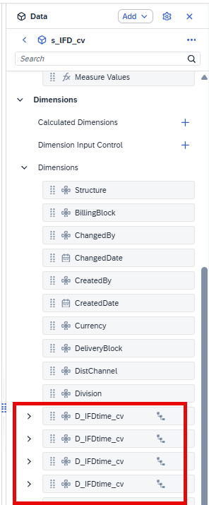
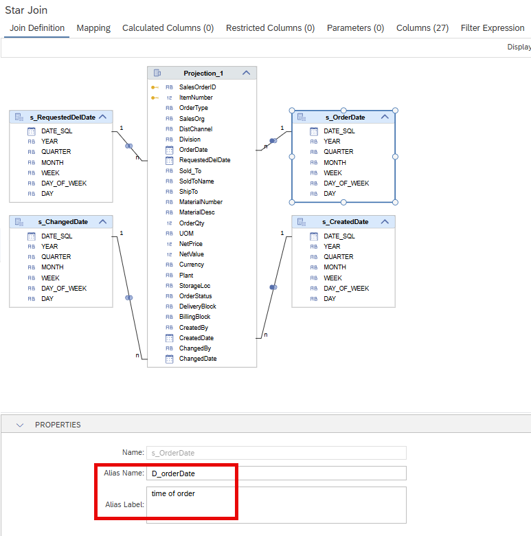
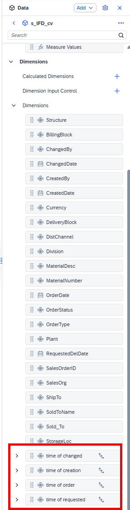
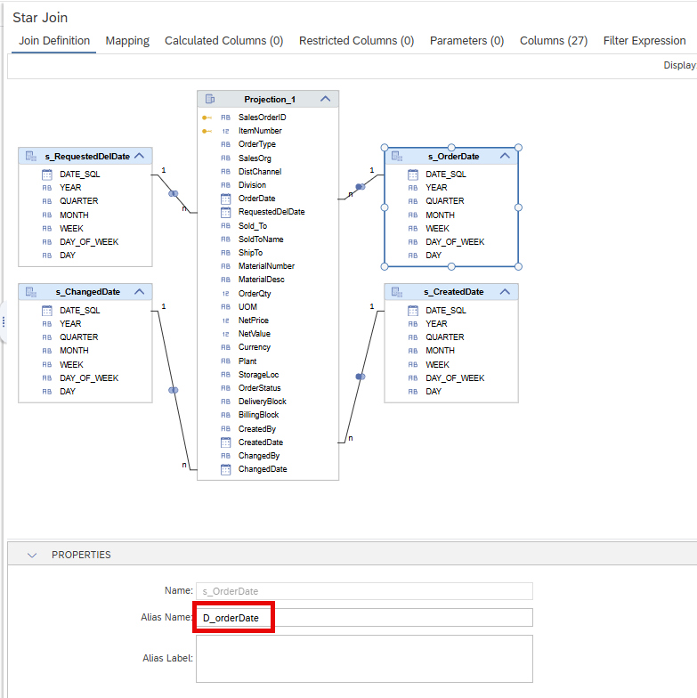
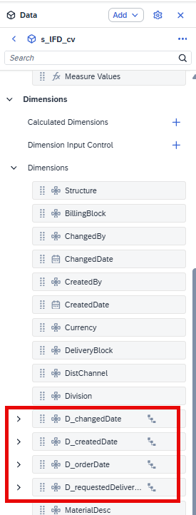
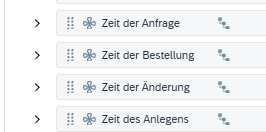

# [Labeling Dimensions](https://help.sap.com/docs/HANA_CLOUD_DATABASE/d625b46ef0b445abb2c2fd9ba008c265/988f5a9bd87c4492ad5c1e6f7936f0b5.html)

When a dimension view is used more than once in the same star-join node, analytics tools display its name multiple times - making it difficult to distinguish between individual usages.



The new label option for dimension views solves this by letting you assign a distinct *Alias Name* and *Alias Label* to each usage. To do so, open the Join Details of the Star Join node, select the dimension view, and fill in the relevant fields under *Properties*:



Once configured, the *Alias Label* becomes available in analytics tools such as SAP Analytics Cloud:



If only the *Alias Name* is maintained then the *Alias Name* is shown in SAC:







## Language-Dependent Labeling

In the [.properties files](https://help.sap.com/docs/hana-cloud-database/sap-hana-cloud-sap-hana-database-deployment-infrastructure-hdi-reference/table-data-properties-properties), the *Alias Name* serves as the entry point for language-dependent texts. By assigning locale-specific values, you can implement full [language dependency](https://help.sap.com/docs/hana-cloud-database/sap-hana-cloud-sap-hana-database-modeling-guide-for-sap-business-application-studio/70e94ba925154151bd3b9c91ad45a9b5.html) for dimension labels.

When you generate a properties file for a calculation view, the *Alias Name* entries appear at the end of the file. The following example shows German translations:

```XML
#XTIT, 255
D_changedDate=Zeit der Änderung
#XTIT, 255
D_requestedDeliveryDate=Zeit der Anfrage
#XTIT, 255
D_orderDate=Zeit der Bestellung
#XTIT, 255
D_creationDate=Zeit des Anlegens

```

These translations are then reflected in SAC:




> If multiple dimensions share the same source view, define unique alias names to ensure they can be clearly distinguished in reporting tools such as SAP Analytics Cloud.