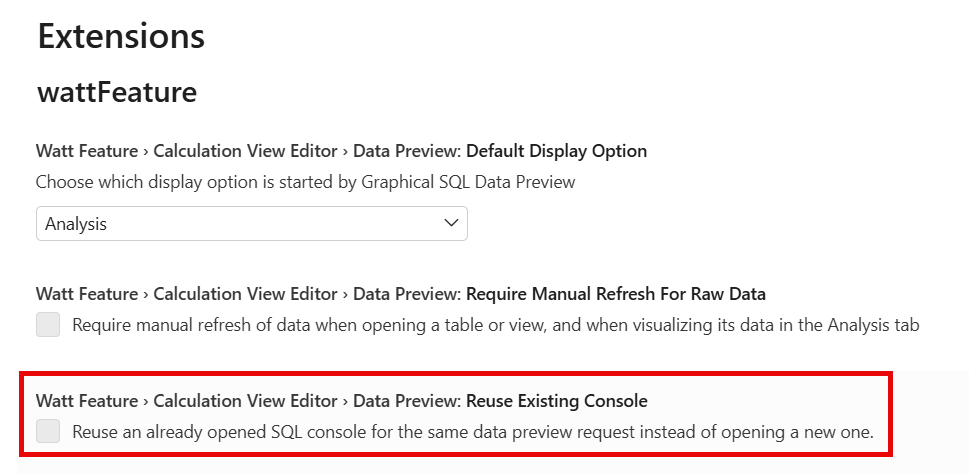

# [Open New SQL Console for Data Preview](https://help.sap.com/docs/HANA_CLOUD_DATABASE/d625b46ef0b445abb2c2fd9ba008c265/92883c2b13c74649b183590c4b5744ae.html)
Each Data Preview now opens in a dedicated SQL console by default. This preserves your previous results and any SQL modifications, making it easier to compare outputs across multiple previews.
To revert to the previous behavior - where all previews share a single console - select option "Reuse Existing Console" under: [Settings > Watt Feature > Calculation View Editor > Data Preview:]:

The first time you open a Data Preview in your developer workspace with this new behavior, you will be prompted to choose your preferred behavior.

> Open a new SQL console for each Data Preview to compare results and retain SQL modifications across sessions.

