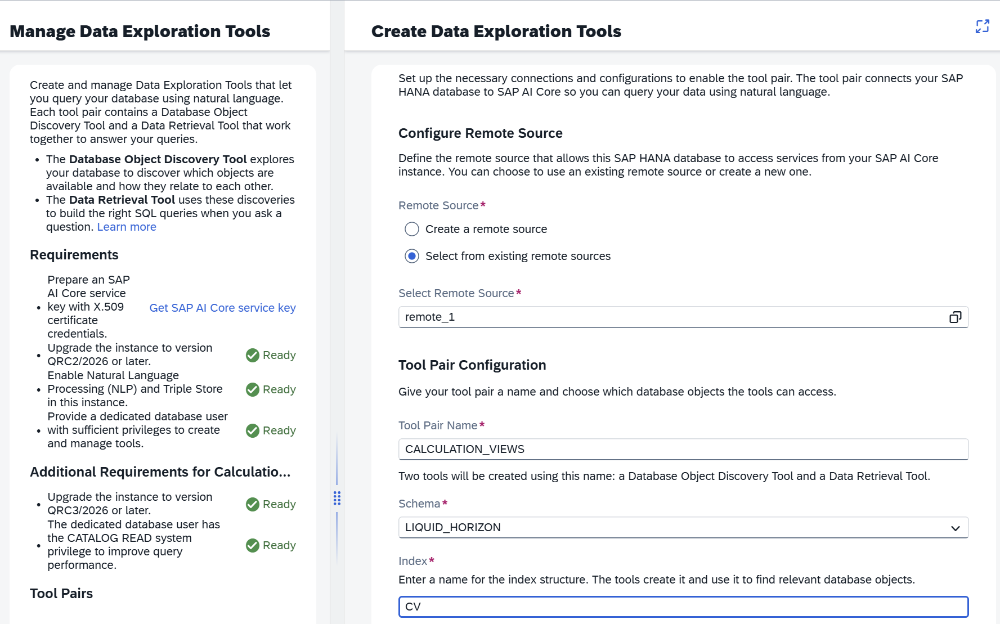
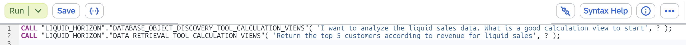

# Calculation Views in Discovery and Retrieval Tools

Metadata from calculation views can be easily published to a knowledge graph in SAP HANA Cloud Central, making them discoverable and queryable by AI-assisted discovery and retrieval tools such as the *Data Exploration Tools* in SAP HANA Cloud Central:

Once included, discovery tools can surface calculation views when users search for relevant data objects or ask questions about available data assets using the generated procedures:

The natural language question is simply passed as the first parameter of the procedures.

> Upload your calculation view metadata to a knowledge graph via SAP HANA Cloud Central for AI assisted data discovery and retrieval using natural language
