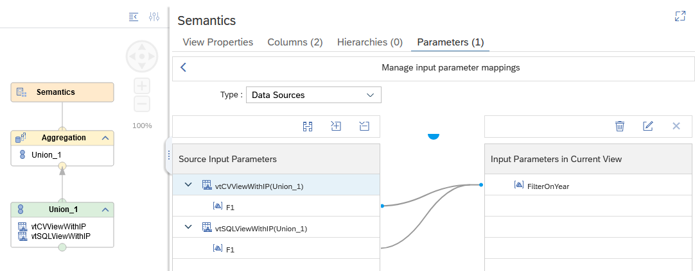

# Map input parameters of Calculation Views to parameters of remote views

**Given that this scenario has some dependencies to external objects, the extension "txt" has been added to all files. To successfully deploy the folder, you need to setup a remote source "TORJZ" and be able to grant CREATE VIRTUAL TABLE via a user-provided service "UPS_QRC1_2022". Remove the extension "txt" afterwards**

Input parameter "FilterOnYear" in Calculation View "mapToRemoteViews" is mapped to input parameter "F1" of a remote Calculation View via virtual table "vtCVViewWithIP" and to parameter "F1" of a remote SQL view via virtual table "vtSQLViewWithIP":



The remote parameters are used to filter for the year that is entered for the input parameter "FilterOnYear":

```SQL
SELECT TOP 1000
	"year",
	COUNT("amount") AS "amount"
FROM "mapToRemoteViews"
	(placeholder."$$FilterOnYear$$"=>'2021')
GROUP BY "year"
```

Mapping parameters to remote views requires a SDA connection (using adapter "hanaodbc") to a HANA database on at least HANA 2.0


