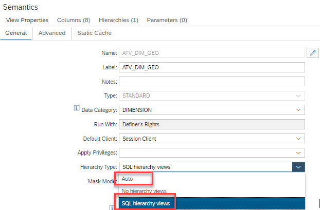
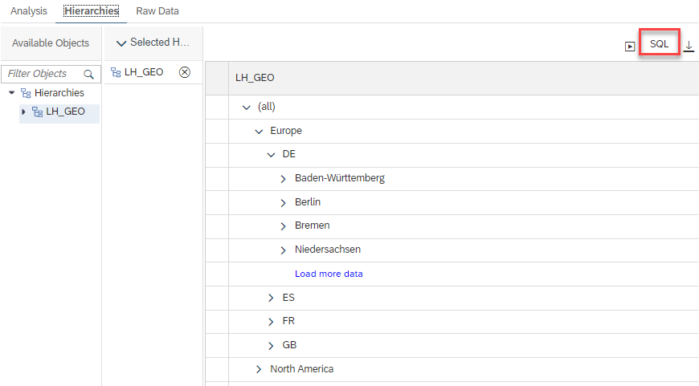
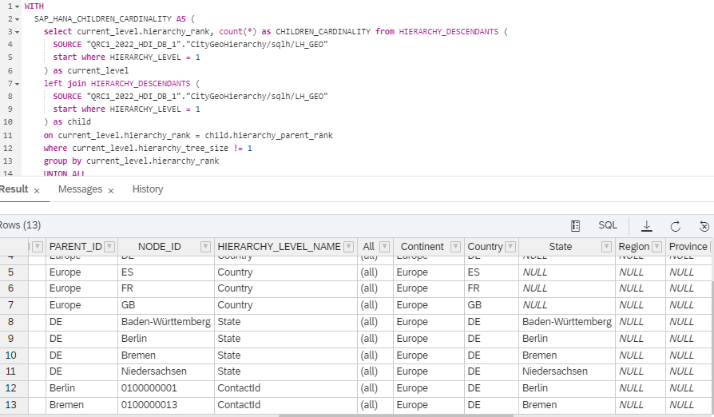

# Data Preview of Hierarchies

During data preview it is now possible to also display hierarchies. 

## Pre-Requisite for Data Preview of Hierarchies
The hierarchies need to be deployed as SQL hierarchy views (either Hierarchy Type "Auto" or "SQL hierarchy views"):

## Hierarch Example

## Retrieve data behind hierarchy
The SQL statement that appears when clicking the top right button of the previous screenshot can be used to retrieve the data that are shown in the hierarchy and as a starting point to desing own SQL queries for hierarchy navigation:

