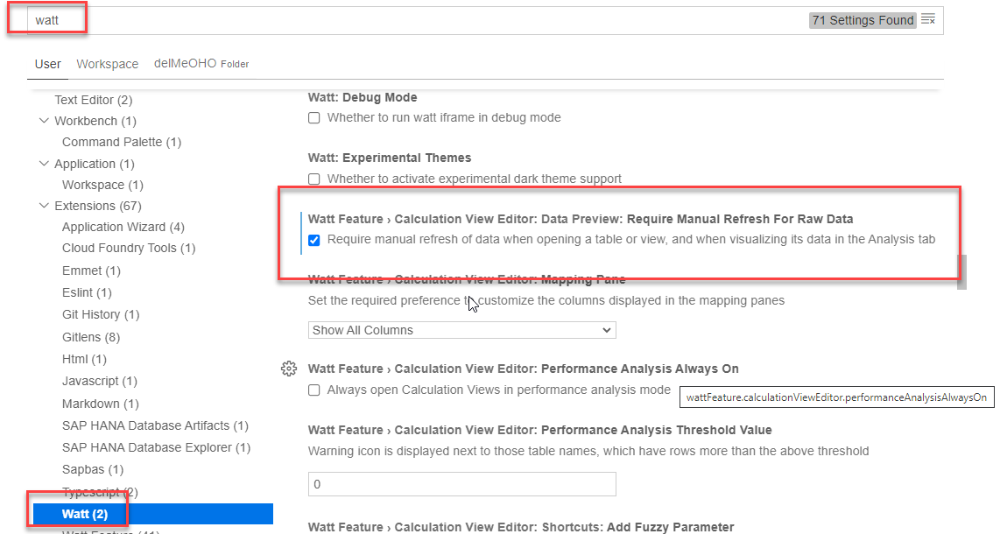

# Control automatic refresh of data preview query

Per default when starting a data preview, a query that includes all columns and no filters is executed. This can lead to long runtimes and high resource consumptions that are unneccessary if the user is only interested in a  restricted query. 

To allow modification of the query prior to executing it, the automatic execution of the preview query can be switched off. Afterwards a manual refresh is required to request data in the Raw tab.

To turn off automatic refresh go to 

*File --> Preferences --> Open Preferences:*

