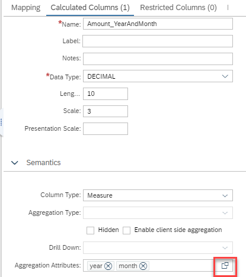
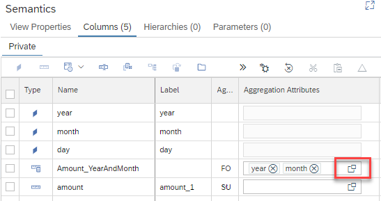

# [Attribute Aggregation Information](https://help.sap.com/docs/HANA_CLOUD_DATABASE/d625b46ef0b445abb2c2fd9ba008c265/75d591f3bb6d4b01a2ac988cf5e2c01d.html)

Define for a measure which attributes to include in a query when assembling the query. Information about the expected attributes is stored in the BIMC metadata and can be retrieved from e.g., view [BIMC_EXCEPTION_AGGREGATION_ATTRIBUTES_VIEW](https://help.sap.com/docs/HANA_CLOUD_DATABASE/88fe5f56472e40cca6ef3c3dcab4855b/b72c2b08cb5e4e68a54647a3b23aec4a.html). It is up to the analytic tools to evaluate these metadata and to create queries that include these attributes.

## How to define which attributes are expected when querying a measure

The respective attributes can be defined for calculated measures when working on the definition of calculated measures or in the Columns tab of the Semantics node for all type of measures.
### Calculated Measures

Under the Semantics section of calculated measures the respective Aggregation Attributes can be selected using the value help button:



### Columns Tab of Semantics Node
Using the value help option of column "Aggregation Attributes" the respective Aggregation Attributes can be chosen:



The following example illustrates how aggregating by different attributes can change the results of a query. The expected behavior of analytic tools to change the queries based on the metadata information in view [BIMC_EXCEPTION_AGGREGATION_ATTRIBUTES](https://help.sap.com/docs/HANA_CLOUD_DATABASE/88fe5f56472e40cca6ef3c3dcab4855b/b72c2b08cb5e4e68a54647a3b23aec4a.html) is mimicked by explicitly defined SQL queries below.

## Example

In example [attribute aggregation](./attributeAggregation.hdbcalculationview) the average of measure "amount" depends on the attributes that are used when requesting the calculation view. According to the attribute aggregation information defined in the model, "amount" should be requested with attributes "year" and "month" even if the final result only includes "year" and not "month":

### Query averaging per month first
```SQL
SELECT 
	"year",
	AVG("amount") AS "amount"
FROM 
(
	SELECT 
		"year","month", AVG("amount") AS "amount" FROM "attributeAggregationExample"
	GROUP BY 
		"year",
		"month"  -- "month" is used in aggregation 
)
GROUP BY 
    "year"
```
### Results

**year**|**amount**
:-----:|:-----:
2022|151.35

Averaging first on "year" and "month" granularity and then averaging the individual month-averages typically leads to slightly different values than averaging directly across all days of a year. This can be seen by comparing the result when "month" is not included in the first averaging:

### Query averaging across days

```SQL
SELECT 
	"year",
	AVG("amount") AS "amount"
FROM 
(
	SELECT 
		"year", AVG("amount") AS "amount" FROM "attributeAggregationExample" 
	GROUP BY 
		"year"
)
GROUP BY 
	"year"
```

### Results

**year**|**amount**
:-----:|:-----:
2022|151.3**4**


## Querying the metadata
The metadata of aggregation attributes can be found in view _SYS_BI.BIMC_EXCEPTION_AGGREGATION_ATTRIBUTES_VIEW by e.g. running

```SQL
SELECT 
	SCHEMA_NAME,
	QUALIFIED_NAME,
	MEASURE_NAME,
	EXCEPTION_AGGREGATION_ATTRIBUTE
FROM 
	_SYS_BI.BIMC_EXCEPTION_AGGREGATION_ATTRIBUTES_VIEW
```


<br/>
<br/>

This should have illustrated how important it is to have the correct attributes in the GROUP-BY of a query. The metadata that is stored in [BIMC_EXCEPTION_AGGREGATION_ATTRIBUTES](https://help.sap.com/docs/HANA_CLOUD_DATABASE/88fe5f56472e40cca6ef3c3dcab4855b/b72c2b08cb5e4e68a54647a3b23aec4a.html) is now available for analytic tools to be evaluated and to create the respective queries.

**It is now possible to define which attributes are expected to be included in a query that requests a measure. To be effective these metadata need to be interpreted by the clients. Defining aggregation attributes does not automatically change query processing. Instead analytic tools can make use of the metadata when formulating their queries**