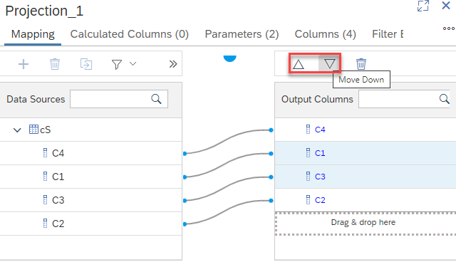

# [Change Sequence of Columns in Mapping Tab](https://help.sap.com/docs/HANA_CLOUD_DATABASE/d625b46ef0b445abb2c2fd9ba008c265/ffe1a32156414237901d6ada03beb0ef.html)

The sequence in which output columns appear in the Mapping tab can now be individually adjusted by downward and upward buttons:

To move multiple columns at once click on the individual columns while using keyboard key CTRL. Depending on the selected columns the Up or Down buttons can become inactive.

>See [changing the sequence of elements](https://help.sap.com/docs/HANA_CLOUD_DATABASE/d625b46ef0b445abb2c2fd9ba008c265/ffe1a32156414237901d6ada03beb0ef.html) and [changing the sequence of data sources in nodes](https://help.sap.com/docs/HANA_CLOUD_DATABASE/d625b46ef0b445abb2c2fd9ba008c265/fe537212b56447ee9dacdbb5527fa0dd.html) for other options to change the sequence of elements.

**Adapting the sequence of output columns can simplify the mapping of columns and can provide a better insight into how columns are mapped.**