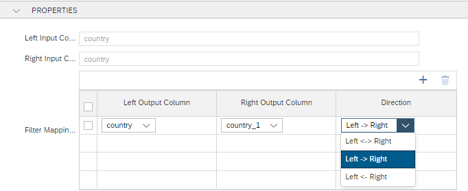
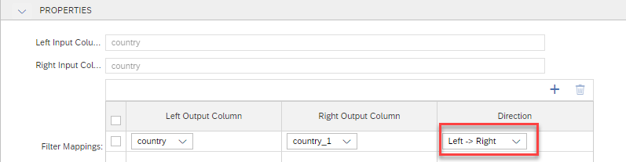
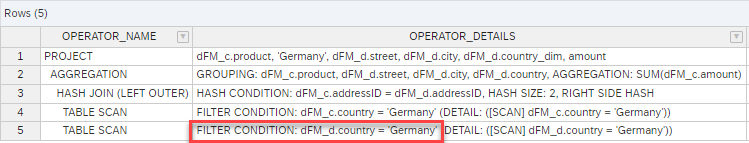
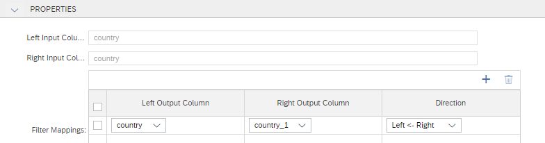
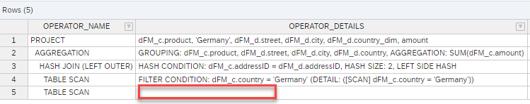

# Option to specify direction of [Filter Mapping](https://help.sap.com/docs/HANA_CLOUD_DATABASE/d625b46ef0b445abb2c2fd9ba008c265/997ec7b767794160a373894ee96a365f.html)

It is now possible to define in which direction filters are mapped. 

When defining the filter mapping, choose between mapping

- in both directions
- only from left to right
- only from right to left





## Examples

In calculation view [dFM_ex_cv](./dFM_ex_cv.hdbcalculationview) filters on column "country" are mapped from left to right:



Running an Explain Plan with query

```SQL
SELECT
	"product",
	"country",
	"street",
	"city",
	"country_dim",
	SUM("amount") AS "amount"
FROM 
	"dFM_ex_cv"
WHERE
	"country"='Germany'
GROUP BY 
	"product", 
	"country", 
	"street", 
	"city", 
	"country_dim"
```
Shows that the filter on country is executed on both join partners:



After changing the filter mapping direction to right to left:



The Explain Plan does not show a filter on the right join partner anymore:


