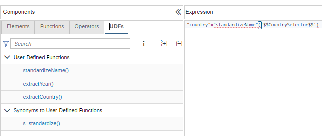

# [User-Defined Functions in Filter Expressions and Calculated Columns](https://help.sap.com/docs/HANA_CLOUD_DATABASE/d625b46ef0b445abb2c2fd9ba008c265/150a8dec9cc64aad96bafb452df29a7b.html)

User-Defined functions can be used in expressions of filters and calculated columns to e.g., 

a) pre-process values of input parameters

b) reuse logic

You can select User-Defined Functions similarly to how you select delivered functions. The list of User-Defined Functions is structured into two sections: functions in the same project and synonyms that point to User-Defined Functions:

## Examples

### Pre-processing
Example [preProcessing](./preProcessing/UDFOnIP_cv.hdbcalculationview) demonstrates how a User-Defined Function can be used to pre-process input parameters, e.g., to transform entered abbreviations such as "GE" into full names such as "Germany" in the filter expression. This is solved by looking the values up in mapping table [mapping table](./preProcessing/countryMapper.hdbtable) in the User-Defined function [standardizeName](./preProcessing/standardizeName.hdbfunction).

### Reuse of logic
Using User-Defined Functions offers an option to encapsulate logic into a function to reuse it in multiple contexts. This harmonizes logic and reduces the effort of redundant code development. For example, User-Defined Functions can be shared across HDI containers. Calculation view [reuseOfLogic_cv](./reuseOfLogic/reuseOfLogic_cv.hdbcalculationview) uses the User-Defined Functions [extractCountry](./reuseOfLogic/extractCountry.hdbfunction) and [extractYear](./reuseOfLogic/extractYear.hdbfunction) in its calculated columns.
