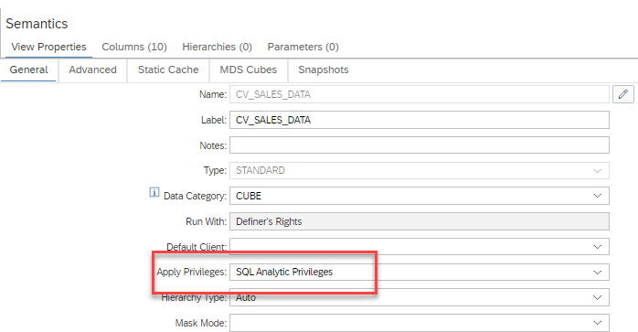

# Secure MDS Cubes by Analytic Privileges

Since the introduction of MDS Cubes more and more functionalities of calculation views have been made available for MDS Cubes. With QRC1 2024 it is now possible to secure an MDS Cube with [analytic privileges](https://help.sap.com/docs/hana-cloud-database/sap-hana-cloud-sap-hana-database-modeling-guide-for-sap-business-application-studio/defining-data-access-privileges). The analytic privilege setting of the calculation view and its analytic privileges will be applied to the MDS Cube as well. Analytic privileges to be used when reporting on the MDS Cube can only be based on columns that are available in the MDS Cube.

## Example
In this example, Calculation view [CV_SALES_DATA](./CV_SALES_DATA.hdbcalculationview) is secured by analytic privileges:



Users will only see data of CV_SALES_DATA and its MDS Cube if they have SELECT and analytic privileges for the calculation view. 

- Analytic privilege [AP_Group1](./privileges/AP_Group1.hdbanalyticprivilege) authorizes users to see records which have one of the values *ITM0000001, ITM0000002, ITM0000003, ITM0000004, ITM0000005* in column *itemid*.

- Analytic privilege [AP_Group2](./privileges/AP_Group2.hdbanalyticprivilege) authorizes users to see records which have one of the values *ITM0000006, ITM0000007, ITM0000008, ITM0000009, ITM00000010* in column *itemid*

As a consequence users with analytic privilege *AP_Group1* will see only records with *itemid* value *ITM0000001-ITM0000005* while users with analytic privilege *AP_Group2* will see only records with *itemid* value *ITM0000006-ITM00000010*.

Users who have been assigned both analytic privileges will see all *itemid* values *ITM0000001-ITM00000010*

These analytic privileges have been included in roles [R_Group1](./roles/R_Group1.hdbrole) and [R_Group2](./roles/R_Group2.hdbrole) respectively. For simplicity both roles also include the SELECT privilege for [CV_SALES_DATA](./CV_SALES_DATA.hdbcalculationview).

### Create database user for reporting on MDS Cube
The following statements assign the SELECT and analytic privilege which are included in role *AP_Group1* to database user *G1* when executed with a user that is *USERGROUP OPERATOR* and has system privilege *ROLE ADMIN* (e.g., user *DBADMIN*). Make sure to replace <schema_name> with the schema_name of your HDI container:

```language SQL
create user G1 password "DnATBG!1" NO FORCE_FIRST_PASSWORD_CHANGE;
grant <schema_name>."R_Group1" to G1;
```

This database user can be used when connecting with e.g. SAP Analytics Cloud.

## Loading of MDS Cube
Database users can only report on MDS Cube data that are loaded into the MDS Cube. Therefore, the database user who is used to load the MDS Cube needs the superset of all analytic privileges of the users that report on the MDS Cube. Below is an example how to create such an user and grant the required privileges (use a user such as DBADMIN that is *USERGROUP OPERATOR* and has e.g., system privilege *ROLE ADMIN* ):

```language SQL
create user MDS_CUBE_LOADER password "DnATBG!1" NO FORCE_FIRST_PASSWORD_CHANGE;
grant <schema_name>."R_Group1" to MDS_CUBE_LOADER;
grant <schema_name>."R_Group2" to MDS_CUBE_LOADER;
```


For administrating the MDS Cube this user also needs privilege *CREATE ANY* for the HDI schema in which the MDS Cube resides. This privilege is contained  in role [R_CreateAny](./roles/R_CreateAny.hdbrole). Additionally, the privilege to execute procedure SYS.MANAGE_MDS_CUBE is required:


```language SQL
grant <schema_name>."R_CreateAny" to MDS_CUBE_LOADER; 
grant execute on SYS.MANAGE_MDS_CUBE to MDS_CUBE_LOADER;
```


With these privileges in place database user MDS_CUBE_LOADER can connect to the database and request status information about the MDS Cube as well as load the MDS Cube:

```language SQL
connect MDS_CUBE_LOADER password "DnATBG!1";
```


```language JSON
call MANAGE_MDS_CUBE('
{
    "Cube": {
        "Command": "List"
    }
}
',
?);
```


```language JSON
call MANAGE_MDS_CUBE('
{
   "Cube": {
      "Command": "Reload",
      "Target": {
         "DataSource": {
            "SchemaName": "<schema_name>,
            "ObjectName": "CV_SALES_DATA/mdscube/MDSCube_CV_SALES_DATA"
         }
      }
   }
}
',
?
)
```


> Make sure to replace "<schema_name>" with the value for *SchemaName* that is returned by the List command above.