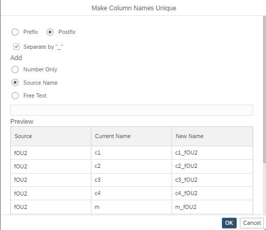

# [Choose How To Make Columns Unique](https://help.sap.com/docs/hana-cloud-database/sap-hana-cloud-sap-hana-database-modeling-guide-for-sap-business-application-studio/make-column-names-unique)

It is now possible to choose in which way naming conflicts are resolved that arise when columns with the same name are mapped.

The dialog is started if a naming conflict arises during

a) mapping of columns

b) adding a dimension view into a star-join 

Options to make the column names unique include adding:

- number
- data source name
- static text

to the column name.

The chosen conflict resolution option can be applied as pre-fix or post-fix.

> Per default and if other selected resolve-options lead to further conflicts numbers are added.
