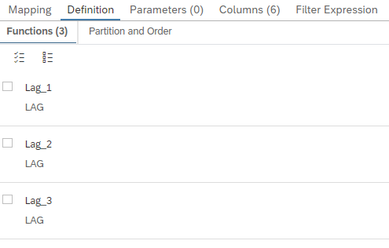
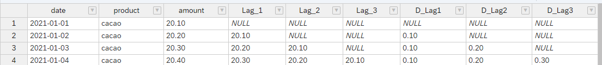

# [Define multiple Window Functions in one Window Function Node](https://help.sap.com/docs/hana-cloud-database/sap-hana-cloud-sap-hana-database-modeling-guide-for-sap-business-application-studio/create-window-function-nodes)

Define multiple window functions in one window function node if the window functions use the same partitioning and ordering. This reduces the effort when modeling several window functions and can lead to improved performance compared to sequential stacking of window function nodes.


## Example

In example [runningSum](./runningSum.hdbcalculationview) the window function lag is calculated with several parameters in the same window function node:



Based on the model several lag calculations are available in reporting:


```SQL
SELECT 
	"date",
	"product",
	SUM("amount") AS "amount",
	SUM("Lag_1") AS "Lag_1",
	SUM("Lag_2") AS "Lag_2",
	SUM("Lag_3") AS "Lag_3",
	SUM("D_Lag1") AS "D_Lag1",
	SUM("D_Lag2") AS "D_Lag2",
	SUM("D_Lag3") AS "D_Lag3"
FROM "multipleWindowFunctions_cv"
GROUP BY "date", "product"
```



## Limitations
- all window functions need to have the same partitioning and ordering
- window functions must not depend on each other


