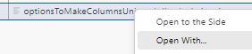
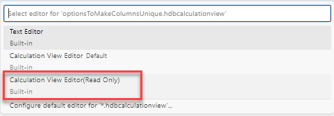
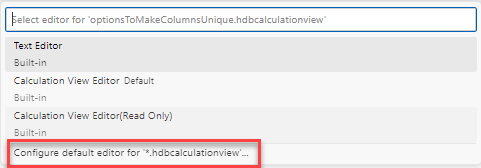

# [Open Calculation Views in Read-Only Mode](https://help.sap.com/docs/hana-cloud-database/sap-hana-cloud-sap-hana-database-modeling-guide-for-sap-business-application-studio/opening-calculation-views-in-read-only-mode)

A developer workspace wide setting is available to switch the default opening mode of calculation views to read-only mode. Opening calculation views in read-only mode can be used to prevent that unintended changes are persisted by the automatic save option. These automatic changes might otherwise flood the change-tracking of e.g., Git.

## Open calculation view in read-only mode individually
A calculation view can be opened in read-only mode when using option "Open With...":

and choosing the Read Only option:

## Persist choice of calculation view editor mode
The choice can be persisted as the default for the developer workspace that is used when opening a calculation view by double-clicking on its file. 
To change the default editor mode, choose option "Configure default editor for '*hdbcalculationview'..." and select the intended editor mode:

>The read-only mode is controlled by the developer and thus not suitable as a security mechanism to prevent the developer from modifying a calculation view. How modifications to deployed calculation views can be prevented is illustrated in a [blog](https://blogs.sap.com/2022/09/23/intermediate-data-previews-on-calculation-views-without-permissions-to-deploy/).
