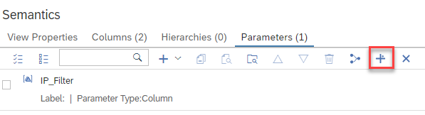
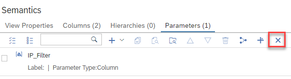

# [Propagate Adding and Deleting of Input Parameters to Consuming Views](https://help.sap.com/docs/hana-cloud-database/sap-hana-cloud-sap-hana-database-modeling-guide-for-sap-business-application-studio/propagate-addition-or-deletion-of-columns)

Input parameters can be propagated to all consuming calculation views within an HDI container. This makes newly added input parameters easily available in all views that make use of the calculation view.

Analogously, input parameters can be removed through the whole view stack of an HDI container starting from the calculation view in which the input parameter is defined.

## Example

Input parameter *IP_Filter* is defined in calculation view [pADIP_cv](./pADIP_cv.hdbcalculationview) which is consumed by calculation view [consumepADIP_cv](./consumepADIP_cv.hdbcalculationview). 


## Propagate Adding Input Parameter
To make *IP_Filter* also available in [consumepADIP_cv](./consumepADIP_cv.hdbcalculationview) button *Propagate Adding Input Parameter* can be used in [pADIP_cv](./pADIP_cv.hdbcalculationview):



This option will create and map the chosen input parameter in the selected dependent views. The input parameter will be created in the dependent calculation views with the same details (e.g., value help information) as the original input parameter.

The consuming calculation view can subsequently be queried by e.g.:

```language SQL
SELECT
	"filterMe",
	SUM("m") AS "m"
FROM "consumepADIP_cv"
	(placeholder."$$IP_Filter$$"=>'2024')
GROUP BY 
    "filterMe"
```
## Propagate Deleting Input Parameter
To remove the input parameter through the stack, use button *Propagate Deleting Input Parameter* in [pADIP_cv](./pADIP_cv.hdbcalculationview):



