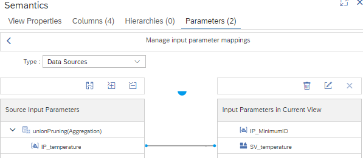
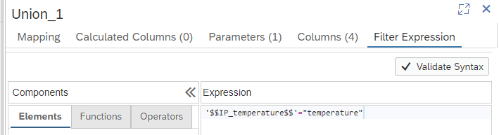
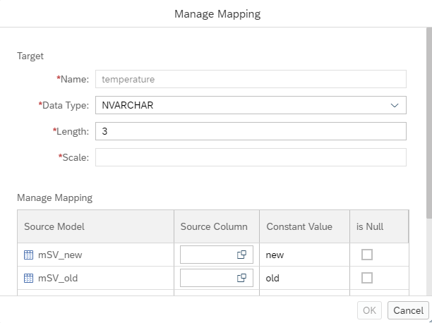
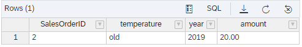

# Map session variable into input parameters

Session variables can now be used to fill input parameters of consumed calculation views.


With this it becomes possible to feed values from the session context into already existing calculation views. For example, a session context can be defined as retrieving current or old data. This session context information can then be made available in input parameters.


## Example: Union pruning based on an input parameter that is filled by a session variable


Input parameter "IP_temperature" is filled by session variable "SV_temperature":




Input parameter "IP_temperature" is used to filter on column "temperature":



Constant union pruning is implemented based on column "temperature":




### Query
```SQL
SELECT 
	"SalesOrderID",
	"temperature",
	SUM("year") AS "year",
	SUM("amount") AS "amount"
FROM "mapSessionVariable"
	(placeholder."$$IP_MinimumID$$"=>'1')
GROUP BY 
	"SalesOrderID", 
	"temperature"
```

### Setting session variable to "old" data:

```SQL
SET 'SV_temperature'='old';
```
### Result



### Setting session variable to "new" data:

```SQL
SET 'SV_temperature'='new';
```

### Result


**This demonstrates how the value of a session variable can be used to filter data**

