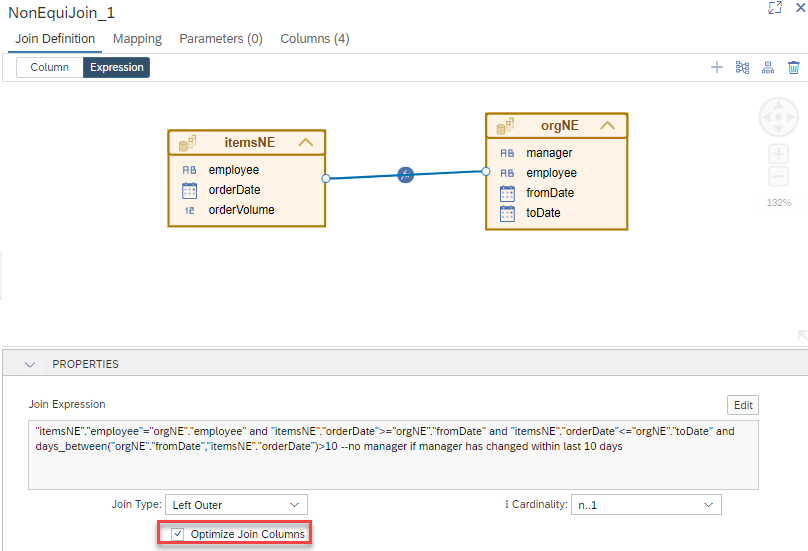

# Optimize Join Columns in non-equi joins

With 2023, QRC2, the setting "Optimize Join Columns" is also available in non-equi-join nodes. This setting has an influence only when join pruning occurs. If join pruning occurs and the join column is not required to fullfill the query, per default, the join column is still requested from the node below the non-equi-join node. If "Optimize Join Columns" is selected and join pruning occurs, then the join columns are only retrieved if they are required to fullfill the query. For details on "Optimize Join Columns" see e.g., [Developer Performance Guide](https://help.sap.com/docs/HANA_CLOUD_DATABASE/4466fb5b5e3f4388a00b44aad5a4bffa/658f369c70d24ec692bfc5f4e4b5f97a.html).

The following query does not require the join column "employee":
```SQL
SELECT 
--	"employee",
	"orderDate",
--	"manager",
	AVG("orderVolume") AS "orderVolume"
FROM "optimizeJoinColumnNE_cv_test"
GROUP BY 
	--"employee", 
	"orderDate"
	--, "manager"
```

However, per default, "employee" which is used in the join definition is still retrieved as can be seen from the corresponding Explain Plan:

**OPERATOR\_NAME**|**OPERATOR\_DETAILS**|
-----|-----|
PROJECT|itemsNE.orderDate, orderVolume|
AGGREGATION|GROUPING: itemsNE.orderDate, AGGREGATION: AVG(AVG(itemsNE.orderVolume))|
AGGREGATION|GROUPING: itemsNE.orderDate, itemsNE.**employee**, AGGREGATION: AVG(itemsNE.orderVolume)|
TABLE SCAN| |


With "Optimize Join Column" set:



join column "employee" is not retrieved anymore if not required to fullfill the query:

**OPERATOR\_NAME**|**OPERATOR\_DETAILS**|
-----|-----|
PROJECT|itemsNE.orderDate, orderVolume|
AGGREGATION|GROUPING: itemsNE.orderDate, AGGREGATION: AVG(itemsNE.orderVolume)|
TABLE SCAN| |