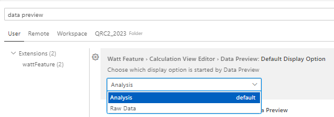
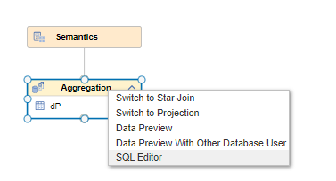

# Improvements to Data Preview

## Change default display mode of data preview

It is now possible to configure whether the data preview per default should open in mode "Raw Data" or "Analysis".

To configure the behavior go to the preference settings under menu File -> Preferences -> Settings and choose the corresponding option:

## Open data preview in SQL editor
- To speed up the data preview, a SQL editor with the respective data preview statement can be directly opened from the context menu of nodes:

    

