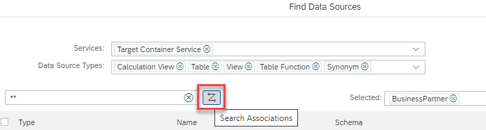
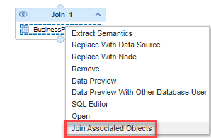

# Use association information when selecting data sources

When selecting data sources of a node, an option is offered to display associated objects:

>For details how to define associations see, e.g., [SQL Reference Guide](https://help.sap.com/docs/HANA_CLOUD_DATABASE/c1d3f60099654ecfb3fe36ac93c121bb/20d58a5f75191014b2fe92141b7df228.html#loio20d58a5f75191014b2fe92141b7df228__create_table_with_association)

Associated objects can also be added using the context menu of a datasource, if the node supports adding additional data sources: 

For join nodes the respective join information of the associations are reused if possible. 

If multiple objects are selected the join order is determined by the order in which the objects have been selected and stacked join nodes are generated.

Using association information simplifies selection of relevant data sources and increases modeling efficiency.

