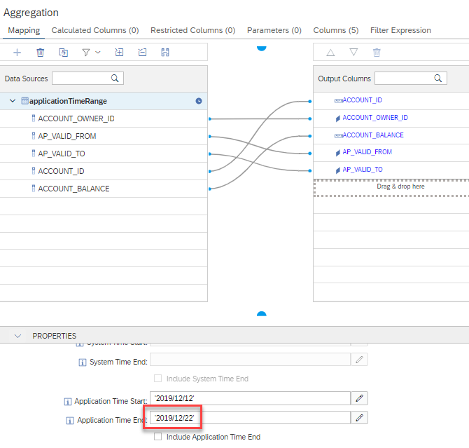

# Range for Application Time Period

It is now possible to specify ranges also for application time in addition to system-versioned time.


## Prepare Data

- Ensure that table is empty

    ```SQL
    truncate table "applicationTimeRange";
    ```

- Insert data

    ```SQL
    insert INTO "applicationTimeRange" VALUES(1,'SAP',20,'2018/01/01','2020/01/02');
    insert INTO "applicationTimeRange" VALUES(1,'SAP',10,'2019/01/03','2020/01/01');
    insert INTO "applicationTimeRange" VALUES(1,'SAP',30,'2020/01/01','9999/12/31');
    insert INTO "applicationTimeRange" VALUES(1,'SAP',40,'2021/01/01','2030/12/31');
    insert INTO "applicationTimeRange" VALUES(2,'SAP',33,'2021/01/01','2030/12/31');
    ```

## Define application time range



## Run Query

```SQL

SELECT
	"ACCOUNT_OWNER_ID",
	"AP_VALID_FROM",
	"AP_VALID_TO",
	SUM("ACCOUNT_ID") AS "ACCOUNT_ID",
	SUM("ACCOUNT_BALANCE") AS "ACCOUNT_BALANCE"
FROM "applicationTimeRange_cv"
GROUP BY "ACCOUNT_OWNER_ID", "AP_VALID_FROM", "AP_VALID_TO"

```

## Result

**ACCOUNT\_OWNER\_ID**|**AP\_VALID\_FROM**|**AP\_VALID\_TO**|**ACCOUNT\_ID**|**ACCOUNT\_BALANCE**
:-----:|:-----:|:-----:|:-----:|:-----:
SAP|2018-01-01|2020-01-02|1|20
SAP|2019-01-03|2020-01-01|1|10