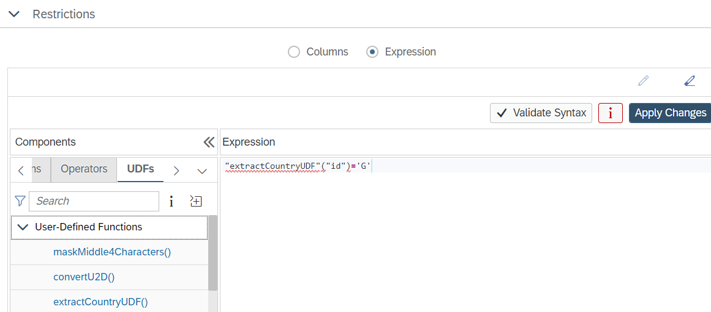

# User-Defined Functions in Non-Equi-Join, Restricted Column and Column Masking Expressions

Calculation View [maskingUDF](./masking/maskingUDF.hdbcalculationview) demonstrates how user-defined functions can be used in masking expressions to reuse masking logic and to provide additional flexibility in the definition of the masking expression.

Calculation View [nonEquiUDF](./nonEquiJoins/nonEquiUDF.hdbcalculationview) shows an example in which user-defined functions are used to convert between different represenations of join columns values.

Calculation View [restrictedUDF](./restrictedMeasures/restrictedUDF.hdbcalculationview) illustrates how user-defined functions can be leveraged in restricted measures to pre-process column values before using them in restrictions:



```SQL
SELECT
	SUM("amount") AS "amount",
	SUM("AmountUS") AS "AmountUS",
	SUM("AmountChina") AS "AmountChina",
	SUM("AmountGermany") AS "AmountGermany"
FROM "restrictedUDF"
```

**amount**|**AmountUS**|**AmountChina**|**AmountGermany**
:-----:|:-----:|:-----:|:-----:
32.00|8.00|14.00|10.00