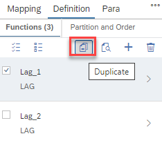
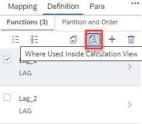

## [Duplicate a Window Function Definition](https://help.sap.com/docs/hana-cloud-database/sap-hana-cloud-sap-hana-database-modeling-guide-for-sap-business-application-studio/create-window-function-nodes?)

The option to define multiple window functions within a node is enhanced with the option to duplicate individual window functions:

This allows creating similar window functions more efficiently. 

## [Where used option](https://help.sap.com/docs/hana-cloud-database/sap-hana-cloud-sap-hana-database-modeling-guide-for-sap-business-application-studio/where-used-functionality)

To investigate where the result column of a window function is used inside the current calculation view a Where Used option was added:

