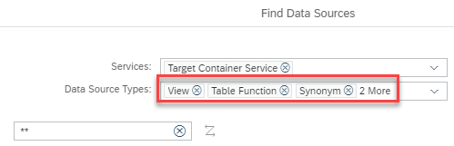

# Reuse last choice of selected data source types in Add Data Source dialog

In the Add Data Source dialog filters for different Data Source Types are used:

The last selected data source types are stored within the developer workspace and reused the next time the Add Data Source dialog is opened in a context that uses the same default data source types. For example, starting the Add Data Source dialog in the context of adding a data source to a node offers different data source types compared to when starting the Add Data Source dialog in the context of selecting a value help view.