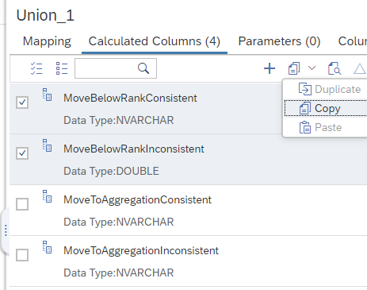
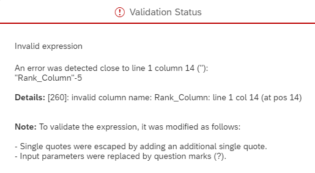

# Copy Calculated Columns between nodes of a Calculation View

In addition to the option to duplicate calculated columns within nodes, calculated columns can now also be copied to other nodes within the same calculation view. Multiple calculated columns can be copied at the same time:

Copying elements can lead to inconsistent definitions if not all required objects are available at the target node. After pasting the copied elements you can detect inconsistent definitions by manually validating the expressions.

