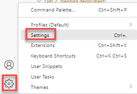
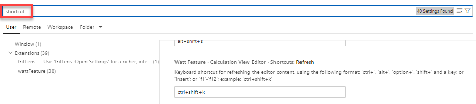

# Keyboard shortcut to refresh calculation view metadata

Refreshing the metadata of an already opened calculation view can now be achieved by a configurable keyboard shortcut.

To change the default keyboard shortcut of CTRL+SHIFT+k:

- go to Settings:

    

- search for the term "shortcut" and scroll-down till you find the entry for "Refresh"

    

>The restrictions for changing the entry are described above the entry field

To check the effect of the shortcut use the [example](../../../2023/QRC4/refreshMetadata/info.md) of QRC4 2023.

