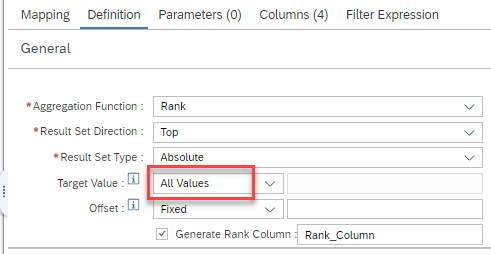

# Return all records after ranking

With the new option *All Values* for *Target Value* in the definition of Rank nodes, all values are returned after ranking. This provides a means to sort values based on a ranking column.




> Further processing steps can change the sequence of records that is returned by the ranking node. Analogous to SQL, result sets of intermediate nodes do not have an inherent order. The order should therefore be defined in the requesting query based on the generated rank column
or the [result set sort](https://help.sap.com/docs/hana-cloud-database/sap-hana-cloud-sap-hana-database-modeling-guide-for-sap-business-application-studio/sort-result-set) option should be used. 


For example, use the following query to return, after skipping the first 10 records for each logical partition, all records of calculation view [rAR_cv](rAR_cv.hdbcalculationview) 

```SQL
SELECT 
	"Rank_Column",
	"name",
	"product",
	SUM("preference") AS "preference"
FROM "rAR_cv"
GROUP BY "Rank_Column", "name", "product" 
ORDER BY "product","Rank_Column" DESC
```