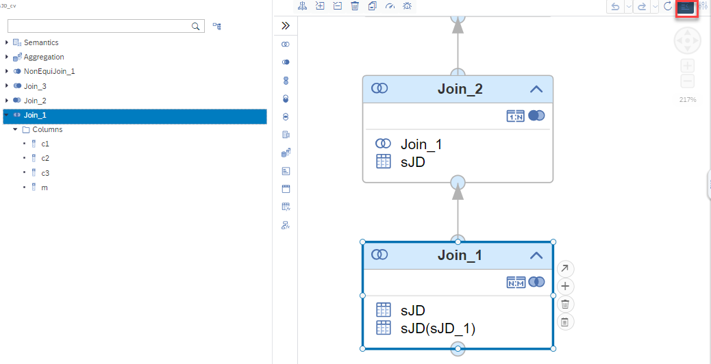

# Show Join Type in Outline

The join type of join nodes is now reflected in the icons of the Outline:

Selecting the individual entities of the Outline moves the respective nodes in the modeling area into focus so that additional details such as cardinality information can be seen.
