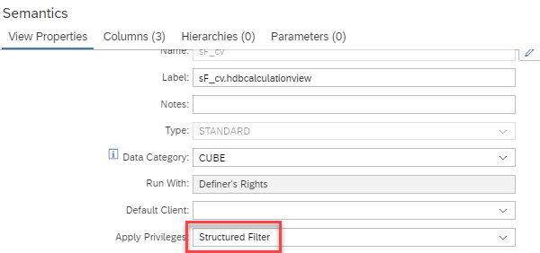

# Secure calculation views by structured filters

### Background information
[Structured filters](https://help.sap.com/docs/hana-cloud-database/sap-hana-cloud-sap-hana-database-sql-reference-guide/create-structured-filter-statement-data-definition) are an alternative option to [structured privileges](https://help.sap.com/docs/hana-cloud-database/sap-hana-cloud-sap-hana-database-modeling-guide-for-sap-business-application-studio/structure-of-analytic-privileges) (.hdbanalyticprivilege) for securing calculation views. The main difference between structured privileges and structured filters is that structured filters are automatically effective for all database users; no assignment of the structured filter to database users is required. 

A given view can only be secured by one type of privilege check.

### How to secure a calculation view by structured filters
In the *Semantics* node under *View Properties* select *Structured Filter* for field *Apply Privileges*.




### Example to illustrate effect of structured filters
To create a structured filter execute with an user that has the authorization to alter view "sF_cv" (e.g., has been granted role "altersF_cv"):

```SQL
CREATE STRUCTURED FILTER "sF_sF" FOR SELECT ON "sF_cv" WHERE "filterColumn"='apple';
```

To see that the privilege is automatically effective for every database user run with a user that has SELECT privileges for "sF_cv" 

```SQL
SELECT 
	"filterColumn",
	"column1",
	SUM("m") AS "m"
FROM "sF_cv"
GROUP BY "filterColumn", "column1"
```

> If not all database users should have the same data access rights then the filter string of the structured filter needs to be enhanced to include a check for e.g., session_user