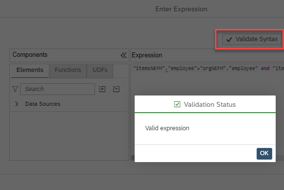

# Validate Option for Non Equi Joins

Non Equi Join expressions can now be validated using the *Validate Syntax* button:

Also expressions that include user-defined functions can be validated.

For an example, use [optimizeJoinColumnNE_cv](./../../../2023/QRC2/cardinalityAndOptimizeJoinColumnSettingForNonEquiJoins/optimizeJoinColumnNE_cv.hdbcalculationview) which is included in the folder of 2023 QRC2