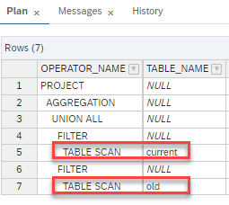

# Evaluate Session Variables Early

Flag "Evaluate Session Variables Early" can be set per calculation view. If set, session variables are evaluated before optimization decisions like, for example, UNION Pruning take place. If not set, the value of the session variable will not be used for UNION pruning decisions in many cases (unfolded scenarios).

A side effect of setting the flag is that no SQL PLAN CACHE entry is created for the query

## Example
Calculation Views "EvaluateEarly" and "DoNotEvaluateEarly" differ only in the setting of the flag "Evaluate Session Variables Early":

 

In the Calculation Views Union Pruning is implemented using constant pruning. The source "old" is mapped to the constant "OLD" and the source "current" to the constant "CURRENT"
 

Filtering in done based on the session variable "SESSION_TYPE":

If flag "Evaluate Session Variables Early" is set, the value of the session variable is evaluated before Union Pruning decisions are done. This means that Union Pruning can be based on the value from the session variable.

## To see the effect:

<ol>
<li> In a data preview SQL console set the session variable "SESSION_TYPE" to e.g., 'CURRENT':

set 'SESSION_TYPE'='CURRENT';
<li> Run an EXPLAIN PLAN for the calculation view for which session variables are not evaluated early:

SELECT 
	"year",
	"ID",
	"PRUNE",
	SUM("amount") AS "amount"
FROM "DoNotEvaluateEarly"
GROUP BY "year", "ID", "PRUNE"

You will see that all sources are included in the EXPLAIN PLAN:

<li> Run the same EXPLAIN PLAN for the calculation view where the session variables are evaluated early:

SELECT 
	"year",
	"ID",
	"PRUNE",
	SUM("amount") AS "amount"
FROM "EvaluateEarly"
GROUP BY "year", "ID", "PRUNE"

</ol>

This shows that by using flag "Evaluate Session Variables Early" UNION pruning occurs also based on session variable filters. This can improve performance significantly

==> Use flag "Evaluate Session Variables Early" if you want to use union pruning based on the session variable as a filter.

#### For more details see:
https://help.sap.com/viewer/4466fb5b5e3f4388a00b44aad5a4bffa/latest/en-US/e9e03565daf741109976addf2810fc3c.html