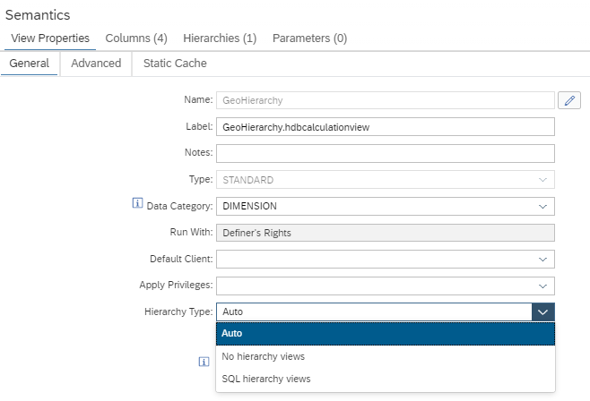
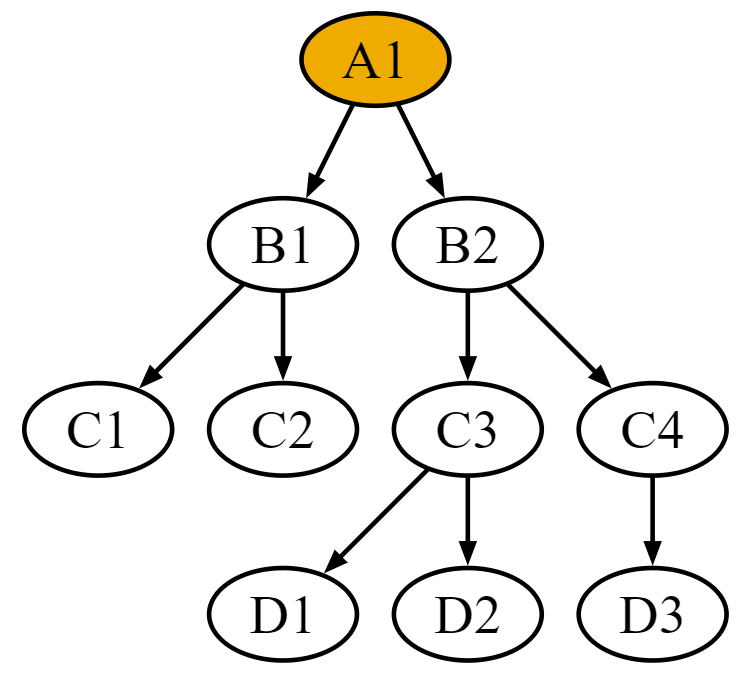

# Type of Generated Hierarchy Views

You can now switch the type of the generated hierarchy views between "Auto" (*default*), "No hierarchy views", and "SQL hierarchy views":



Choose
<ul>
<li>"Auto" if the calculation view should be used on premise and in SAP HANA Cloud, or reporting tools make use of non-SQL hierarchies
<li>"No hierarchy views" if you only need meta data about the hierarchies but don't need the generated hierarchy views
<li>"SQL hierarchy views" if you only want to make use of SQL hierarchy views
</ul>

</br>

As an example for a level hierarchy, you can run the following query to retrieve Cities on continent "Europe":

```SQL
SELECT
    "City",
    "Continent" AS level1,
    "Country" AS level2,
    "State" AS level3
FROM 
--    "GeoHierarchy/sqlh/GeoHierarchy"
-- WHERE 
--    hierarchy_level_name='City' 
-- AND 
--    "Continent"='Europe'
-- for better performance:
HIERARCHY_DESCENDANTS (SOURCE "GeoHierarchy/sqlh/GeoHierarchy" START WHERE node_id = 'Europe') WHERE "City" is not null 
ORDER BY
    hierarchy_rank;

```

As an example for a parent-child hierarchy with the following topology:



```SQL
SELECT
    NODE_ID
FROM HIERARCHY_DESCENDANTS(
    SOURCE "CVParentChild/sqlh/ParentChild"
    START WHERE NODE_ID = 'B2' -- only consider children of B2
	DISTANCE 2                 -- only consider children with distance 2 to B2
)
ORDER BY hierarchy_rank;

```

The respective SQL hierarchy views can be retrieved from column HIERARCHY_VIEW of view _SYS_BI.BIMC_HIEARCHIES_SQL
