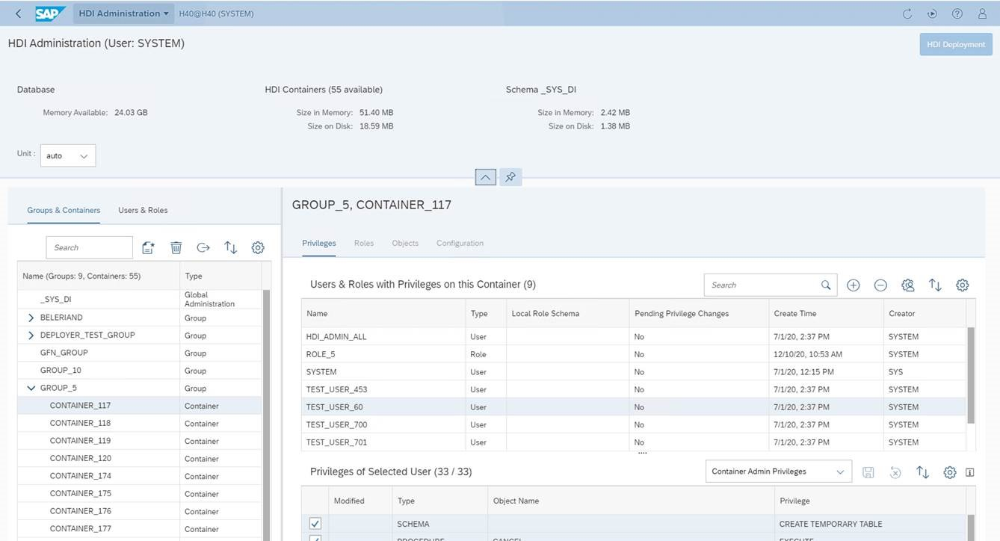
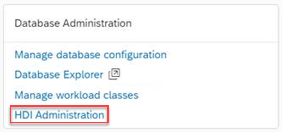

# HDI Administration Cockpit

**Use the HDI Administration Cockpit to**
- get an overview as well as deeper insights into your HDI objects
- administer your HDI objects

**With the HDI Administration Cockpit you can**
- understand the resource consumption at the level of individual HDI objects and at the level of aggregated objects such as containers
- investigate in a flexible way in both directions: 
    - starting from a container  / container group: which users and roles have privileges, detailed list of privileges per user/role
    - starting from roles / users: to which containers / container groups do these belong
- manage all HDI related privileges, roles, users, containers, and container groups

**How to invoke HDI Administration Cockpit**
- go to HANA Database Cockpit
- search for "HDI Administration" by e.g., filtering for "Administration"
- launch the HDI Administration Cockpit by clicking at "HDI Administration"

