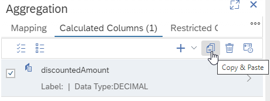

# copy objects

Use the following button to copy e.g.,  already existing calculated columns, parameters, variables, restricted columns, or hierarchies:

By this action details such as the expression are retained