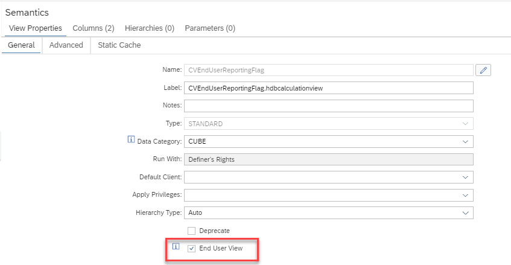

# End User View Flag

End User View is set per view and defaults to ticked if it is not changed explicitly (i.e already existing views and new views will have the status of "End User View" unless they are explicitly changed)

This flag can be used by the creator of a calculation view to indicate whether the calculation view is intented to be used for direct reporting (flag is ticked), or not intented to be directly used in reporting (flag is not ticked). For example, a calculation view can be included in a view-stack and therefore no direct reporting on it is intended. The flag does not signal from a technical or authorization perspective whether the view can be used for reporting: It only signals the <b>intention</b> of the creator of the model.

Reporting tools can query this information from e.g., column END_USER_VIEW of view _SYS_BI.BIMC_CUBES and base on this information the decision whether or not to offer the view for reporting:

SELECT END_USER_VIEW,* FROM _SYS_BI.BIMC_CUBES WHERE CUBE_NAME='CVEndUserView'
