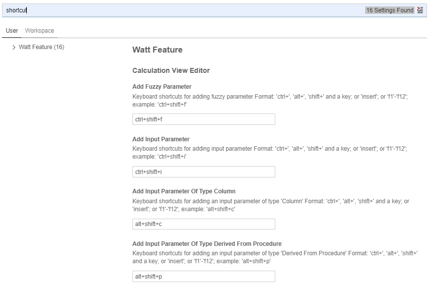

# Keyboard Shortcuts

It is now possible to define keyboard shortcuts for selected modeling actions.

For example, while the focus is on the graphical calculation view editor (e.g., click somewhere into the graphical calculation view editor):
- use CTRL+SHIFT+l to trigger auto layout
- use CTRL+d to trigger deployment

The (default) shortcuts for available modeling actions can be found /changed under 

File --> Settings --> Open Preferences:

search for the term "shortcut"

