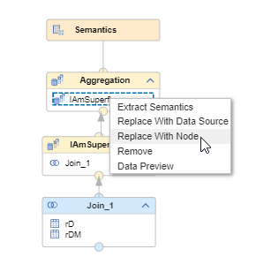

# Replace With Node 

You can replace data sources with nodes by right-clicking on a data source and choosing "Replace With Node"

Use the Replace With Node option for example, to remove superflous nodes without breaking the mapping:

In this example the node "IAmSuperflous" is removed by replacing the source of node "Aggregation" with node "Join_1" (compare calculation views "CVreplaceDialog" and "CVreplaceDialog_afterReplacement").

### The following nodes cannot be selected as replacement nodes:
- direct child-nodes
- nodes into which the current node feeds 
