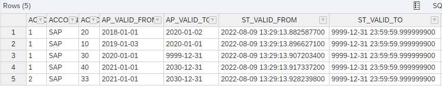
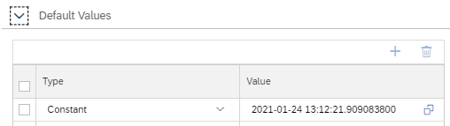
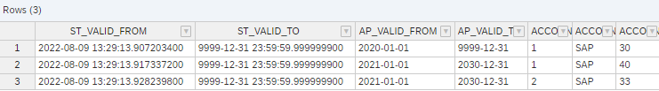

# Example Bi-Temporal Table

## Prepare Data

- Ensure that table is empty

    ```SQL
    truncate table "biVersioning";
    truncate table "biVersioning_history";
    ```

- Insert data

    ```SQL
    insert INTO "biVersioning" VALUES(1,'SAP',20,'2018/01/01','2020/01/02');
    insert INTO "biVersioning" VALUES(1,'SAP',10,'2019/01/03','2020/01/01');
    insert INTO "biVersioning" VALUES(1,'SAP',30,'2020/01/01','9999/12/31');
    insert INTO "biVersioning" VALUES(1,'SAP',40,'2021/01/01','2030/12/31');
    insert INTO "biVersioning" VALUES(2,'SAP',33,'2021/01/01','2030/12/31');
    ```

## Check Temporal Information

```SQL
select * from  "biVersioning";
```




## Query data

Settings of calculation view [BT_example](./BT_example.hdbcalculationview):


Default value of input parameter IPSTART:



> **Do not put single quotes around literals for default values of input parameters**

### Query Data with Default Values of Input Parameters

```SQL
SELECT 
	"ST_VALID_FROM",
	"ST_VALID_TO",
	"AP_VALID_FROM",
	"AP_VALID_TO",
	"ACCOUNT_ID",
	"ACCOUNT_OWNER_ID",
	SUM("ACCOUNT_BALANCE") AS "ACCOUNT_BALANCE"
FROM "BT_example"
	(
	--placeholder."$$IPSTART$$"=>'2021-01-24 13:12:21.909083800', 
	--placeholder."$$IPSTOP$$"=>now(), 
	--placeholder."$$IPAT$$"=>'2021/01/01'
	)
GROUP BY 
	"ACCOUNT_ID", 
	"ACCOUNT_OWNER_ID", 
	"AP_VALID_FROM", 
	"AP_VALID_TO", 
	"ST_VALID_FROM", 
	"ST_VALID_TO"
```


