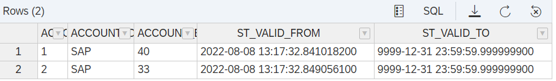
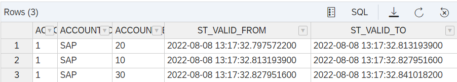
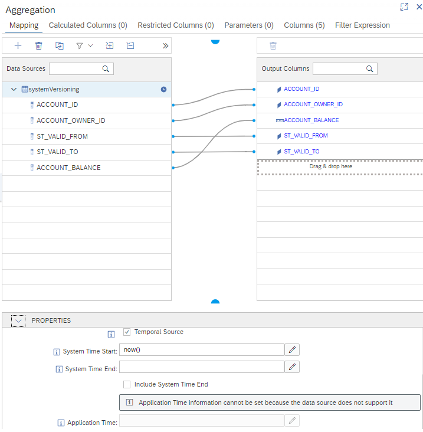
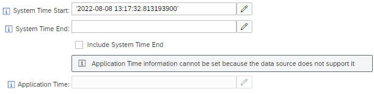
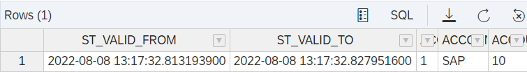
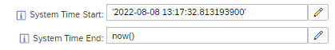
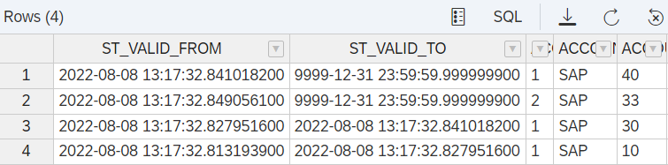

# Example System-Versioned Table

## Prepare Data

- Ensure that tables are empty

    ```SQL
    truncate table "systemVersioning";
    truncate table "systemVersioning_history";
    ```

- Insert data

    ```SQL
    insert into "systemVersioning" VALUES(1,'SAP',20);
    update "systemVersioning" set account_balance=10 where account_id=1;
    update "systemVersioning" set account_balance=30 where account_id=1;
    update "systemVersioning" set account_balance=40 where account_id=1;
    insert INTO "systemVersioning" VALUES(2,'SAP',33);
    ```

## Check Time Stamps


### Current Data
```SQL
select * from  "systemVersioning";
```



### Historical Data
```SQL
select * from "systemVersioning_history";
```



## Query Data


### Query Current Data

Settings of calculation view [SVT_now](./SVT_now.hdbcalculationview).



*If System Time Start is not filled, system-versioned table defaults to now() which will be the timestamp at which the query is executed. Entering now() makes it only more explicit.*

```SQL
SELECT 
	"ST_VALID_FROM",
	"ST_VALID_TO",
	"ACCOUNT_ID",
	"ACCOUNT_OWNER_ID",
	SUM("ACCOUNT_BALANCE") AS "ACCOUNT_BALANCE"
FROM
	"SVT_now"
GROUP BY 
	"ST_VALID_FROM",
	"ST_VALID_TO",
	"ACCOUNT_ID",
	"ACCOUNT_OWNER_ID"
```


### Query Historical Data at Timepoint in Past
In calculation view [SVT_past](./SVT_past.hdbcalculationview), System Time Start is set to a value of ST_VALID_FROM in the history table (you will need to adapt it to the timestamps in your system).



> **Enclose literals in single quotes: '\<literal\>'**

```SQL
SELECT 
	"ST_VALID_FROM",
	"ST_VALID_TO",
	"ACCOUNT_ID",
	"ACCOUNT_OWNER_ID",
	SUM("ACCOUNT_BALANCE") AS "ACCOUNT_BALANCE"
FROM
	"SVT_past"
GROUP BY 
	"ST_VALID_FROM",
	"ST_VALID_TO",
	"ACCOUNT_ID",
	"ACCOUNT_OWNER_ID"
```




### Query Historical Data for a Time Interval in the Past

In calculation view [SVT_past_int](./SVT_past_int.hdbcalculationview), System Version Start keeps the value of a record in the history table and System Version End will be filled with the timestamp when the query is executed based on the expression now().



```SQL
SELECT 
	"ST_VALID_FROM",
	"ST_VALID_TO",
	"ACCOUNT_ID",
	"ACCOUNT_OWNER_ID",
	SUM("ACCOUNT_BALANCE") AS "ACCOUNT_BALANCE"
FROM
	"SVT_past_int"
GROUP BY 
	"ST_VALID_FROM",
	"ST_VALID_TO",
	"ACCOUNT_ID",
	"ACCOUNT_OWNER_ID"
```


