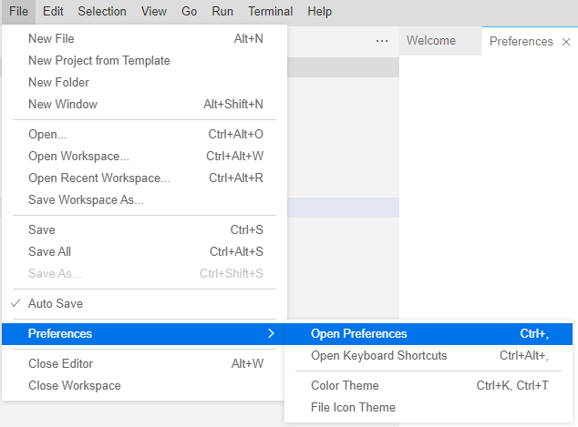

# Debugging Calculation Views without Permissions to Deploy

## Topic
To gain more insights into the intermediate steps of calculation view processing often an option called "intermediate data preview" is used. The intermediate data preview is started by clicking on an intermediate node and choosing Data Preview. As a result the data output of the selected node will be shown. A typical Business Application Studio developer has the required privileges to run intermediate data previews on calculation views that are located in the HDI container of the developer. However, if debugging should happen in a productive container sometimes it is not wanted that the debugging user has also the permission to change the deployed objects. Since 2022 QRC3 an option exists with which it is possible to separate intermediate data preview authorizations from deployment authorizations. The goal of this text is to illustrate the steps that are necessary to run intermediate data previews on HDI containers without having the authorizations to also deploy.


## High-Level Steps
A user-provided service (UPS) will be used to execute the intermediate data preview on calculation views in the target HDI container. The UPS receives its authorizations by the database user that is used in its service definition. This provides the opportunity to grant only the intermediate data preview privileges but no developer privileges to the respective database user. The following high-level steps will be taken:

1.	Create a database user that is later used in the UPS to execute the intermediate data preview
2.	Grant the required privileges to run intermediate data previews to the database user of step 1. 
In particular grant the following privileges: 

    <ol type="a">
    <li>SELECT on the to-be-previewed objects</li>
    <li>EXECUTE on the procedure CREATE_INTERMEDIATE_CALCULATION_VIEW of the target HDI container</li>
    <li>EXECUTE on the procedure DROP_INTERMEDIATE_CALCULATION_VIEW of the target HDI container </li>
    </ol>

3.	In a Cloud Foundry space in which the target HDI container is not deployed, create a UPS with the database user of step 1 in its definition
4.	Use the UPS of step 3 as the target container service
5.	Retrieve the deployed project files
6.	Run the intermediate data preview


The database user and UPS created in steps 1 and 3 can be reused when executing intermediate data previews on other HDI containers. Similarly the HDI container group admin that executes the grants in step 2 can be reused also for other HDI containers. After the initial setup has been done the individual developer only needs to follow steps 4-6.

There are several methods to implement these individual steps and the exact method will depend on your development context. This means some of the detailed steps below might need small adaptions to the way how you are working, e.g., how you create a database user etc.


## Detailed Steps

### Step 1.	Create a database user that is later used in the UPS to execute the intermediate data preview

To create this database user, run with a database user that has the OPERATOR privilege on a user group, for example, the DEFAULT user group:
```SQL
CREATE USER UPSFORFIREFIGHTING PASSWORD "xkrfZlsfg!8U" NO FORCE_FIRST_PASSWORD_CHANGE SET USERGROUP DEFAULT;
```

### Step 2.	Grant the required privileges to run intermediate data previews to the database user of step 1

a)	To grant SELECT privileges for objects on which the intermediate data preview should be run, either assign a role that is created by default such as the access role (see section “HOW CAN I RUN A SELECT STATEMENT ON VIEWS THAT ARE DEPLOYED IN THE NEW ENVIRONMENT?” linked under [FAQ](https://blogs.sap.com/2019/11/13/faq-modeling-in-web-ide/)), or assign a dedicated role that was created in the target HDI container. Such a dedicated role could be generated by e.g., deploying the following .hdbrole file in the HDI container in which calculation views should be debugged:

```SQL
{
  "role": {
    "name": "selectOnSchema",
    "schema_privileges": [
      {
        "privileges": [
          "SELECT"
        ]
      }
    ]
  }
}
```

Make sure that the role grants SELECT privileges for all objects for which data preview should be possible. The following example should illustrate this. 

>In this example, table "salesItems" is directly included in a Projection:
>
>
>
>In addition, this table resides in a different schema and is only referenced via a synonym. In this case, make sure to provide SELECT also for the object in the external schema. The default access role would typically include these SELECT privileges.

Assuming that the role with the SELECT privileges exists: use a database user that has either system privilege ROLE ADMIN or has been granted the role with ADMIN OPTION to assign the role to the database user of step 1:

```SQL
GRANT <HDI target container schema>."selectOnSchema" to UPSFORFIREFIGHTING;
```

Replace \<HDI target container schema\> with your respective HDI container schema name.

b+c) To grant the execute privileges use a HDI container group admin user (see e.g., [Appendix](#appendix) and [here](https://help.sap.com/docs/HANA_CLOUD_DATABASE/c2cc2e43458d4abda6788049c58143dc/97e6309d643d4423869b95b71bf93cf8.html?) how to create such a user). With this HDI container group admin user run:

```SQL
CREATE LOCAL TEMPORARY COLUMN TABLE #PRIVILEGES LIKE _SYS_DI.TT_API_PRIVILEGES; 
INSERT INTO #PRIVILEGES (PRINCIPAL_NAME, PRIVILEGE_NAME, OBJECT_NAME) VALUES ('<database user of step 1>', 'EXECUTE', 'CREATE_INTERMEDIATE_CALCULATION_VIEW'); 
INSERT INTO #PRIVILEGES (PRINCIPAL_NAME, PRIVILEGE_NAME, OBJECT_NAME) VALUES ('<database user of step 1>', 'EXECUTE', 'DROP_INTERMEDIATE_CALCULATION_VIEW'); 
CALL _SYS_DI#BROKER_CG.GRANT_CONTAINER_API_PRIVILEGES('<HDI target container schema>', #PRIVILEGES, _SYS_DI.T_NO_PARAMETERS, ?, ?, ?); 
DROP TABLE #PRIVILEGES;
```

Make sure to replace \<database user of step 1\> and \<HDI target container schema\> with your respective values.

### Step 3.	Create a UPS with the database user of step 1 in its definition
Open SAP Business Application Studio. Make sure that you are connected to a Cloud Foundry space in which the target HDI container is not deployed. If the UPS was in the same space as the HDI service of the target HDI container then users who can use the UPS could also access and deploy to the target HDI container by using the HDI services in the same Cloud Foundry space.

Add a database connection:


Choose to create a UPS and select Provide database information to enter the host and port database information explicitly:


For the host name take the SQL endpoint without the port that you can find in e.g., BTP Cockpit:


Use 443 for the port, and the user and password of the database user created in step 1.

Make sure to fill the "Enter schema name" field with the schema of the HDI container that you want to debug.


### Step 4 Use the UPS created in step 3 as the target container service
Per default UPSs are not allowed to be used for the HDI target container connection. To change this and to allow also UPSs:

In SAP Business Application Studio, under menu “File”: select “Preferences” > “Open Preferences”:



Select the option to bind a UPS to the target container:


Afterwards bind the UPS created in step 3 as the deployment target container service:


### Step 5	Retrieve the deployed project files
You can import the calculation view definitions of the target HDI container by e.g., 
- manually exporting and importing the definitions via the local file system
- synchronizing via Git
- reading the deployed files from the target HDI container

The last option can be achieved by using the "Find Command.." option (short-cut F1) and searching for "recovery":


### Step 6	Run the intermediate data preview


# Appendix

## Example how to make database user DBADMIN an HDI container group admin for container group BROKER_CG

With database user DBADMIN execute:

```SQL
CREATE LOCAL TEMPORARY COLUMN TABLE #PRIVILEGES LIKE _SYS_DI.TT_API_PRIVILEGES;
INSERT INTO #PRIVILEGES (PRINCIPAL_NAME, PRIVILEGE_NAME, OBJECT_NAME) SELECT 'DBADMIN', PRIVILEGE_NAME, OBJECT_NAME FROM _SYS_DI.T_DEFAULT_CONTAINER_GROUP_ADMIN_PRIVILEGES;
CALL _SYS_DI.GRANT_CONTAINER_GROUP_API_PRIVILEGES('BROKER_CG', #PRIVILEGES, _SYS_DI.T_NO_PARAMETERS, ?, ?, ?);
DROP TABLE #PRIVILEGES;
```

>If you want to use a different database user than DBADMIN for executing the statements then this database user needs HDI Admin privileges. You can grant these privileges e.g., by executing:
>```SQL
>CREATE LOCAL TEMPORARY TABLE #PRIVILEGES LIKE _SYS_DI.TT_API_PRIVILEGES;
>INSERT INTO #PRIVILEGES (PRINCIPAL_NAME, PRIVILEGE_NAME, OBJECT_NAME) SELECT >'<database user>', PRIVILEGE_NAME, OBJECT_NAME FROM _SYS_DI.>T_DEFAULT_DI_ADMIN_PRIVILEGES;
>CALL _SYS_DI.GRANT_CONTAINER_GROUP_API_PRIVILEGES('_SYS_DI', #PRIVILEGES, >_SYS_DI.T_NO_PARAMETERS, ?, ?, ?);
>DROP TABLE #PRIVILEGES;
>```


## How to identify the HDI container group of a certain HDI container

To identify the HDI container group of a given container, run with an HDI Admin database user a SELECT query on e.g., `_SYS_DI.M_ALL_CONTAINERS`